# GaussMaster 整体架构与主流程总览

## 1. 系统概述

GaussMaster 是一个面向 openGauss 数据库的智能运维助手系统，基于 RAG（检索增强生成）和 Agent 架构，提供数据库知识问答、故障诊断、工具调用等能力。

### 1.1 核心定位

- **数据库智能助手**：专注于 openGauss 数据库领域的知识问答和运维支持
- **多 Agent 架构**：支持工具调用、故障诊断、报告生成等多种交互模式
- **RAG 增强**：通过向量检索和文本检索结合，提供准确的知识回答
- **企业级部署**：支持 SSL/TLS、多租户、权限控制等企业级特性

### 1.2 技术栈

| 层级 | 技术选型 |
|------|----------|
| Web 框架 | FastAPI + Uvicorn |
| 向量数据库 | openGauss + pgvector 扩展 |
| 元数据库 | SQLAlchemy + PostgreSQL |
| LLM 支持 | Pangu、ChatGLM、Llama、Baichuan 等 |
| 向量化 | 在线 Embedding 服务 |
| 重排序 | 在线 Reranker 服务 |
| 配置管理 | YAML + ConfigParser |

## 2. 整体架构图

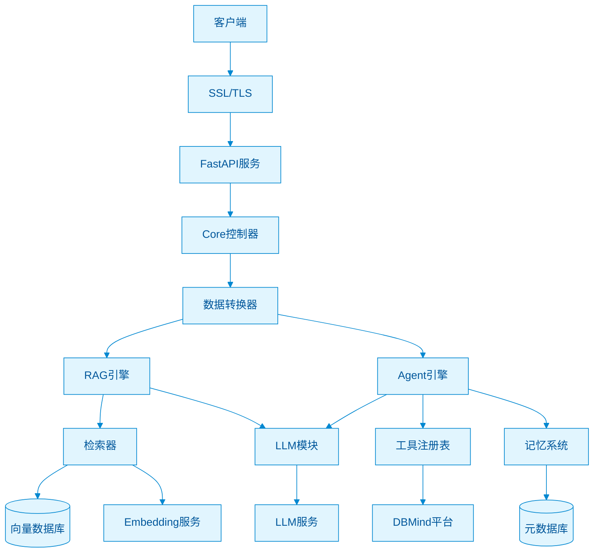

## 3. 核心流程总览

### 3.1 请求处理主流程

**RAG 模式流程：**

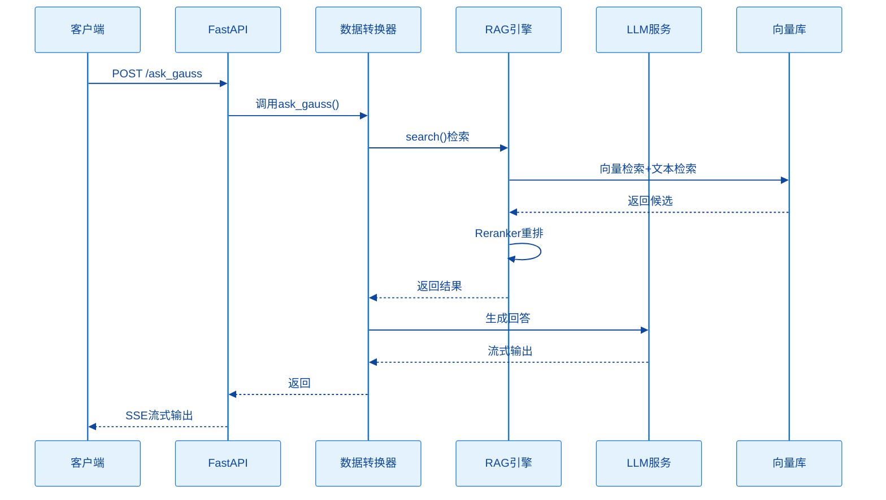

**Agent 模式流程：**

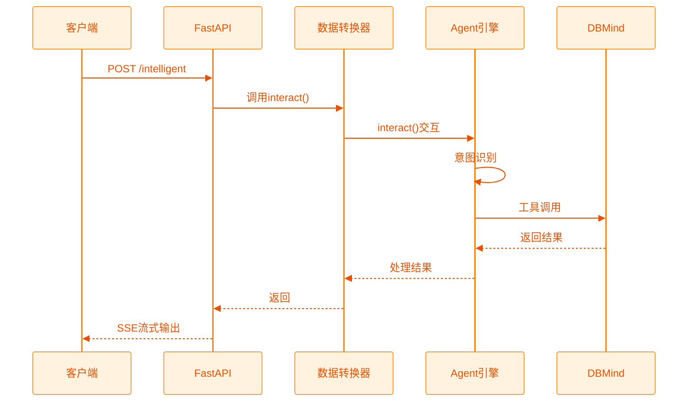

### 3.2 系统启动流程

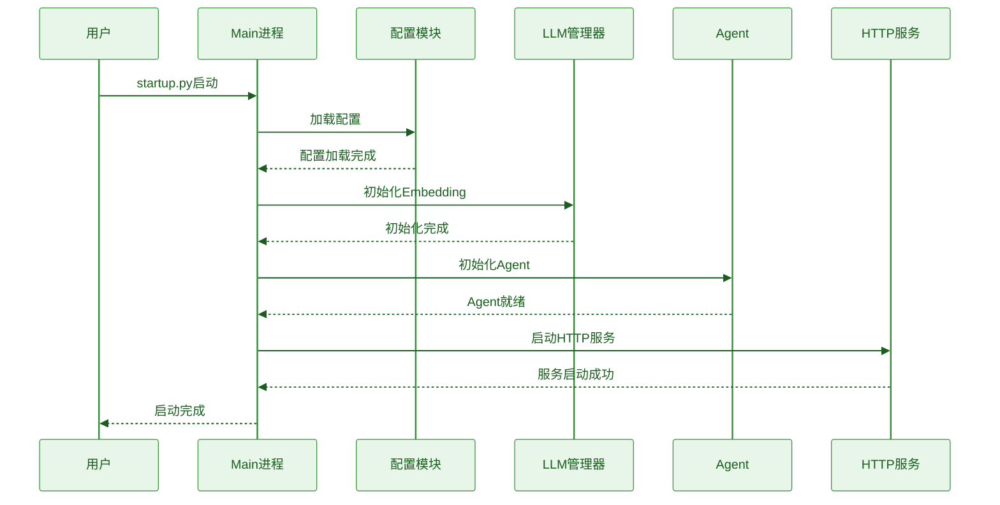

## 4. 核心模块详解

### 4.1 RAG 模块

RAG（Retrieval-Augmented Generation）是 GaussMaster 的核心能力之一，负责从知识库中检索相关知识并生成回答。

**核心组件：**

| 组件 | 文件路径 | 职责 |
|------|----------|------|
| BaseRetriever | `utils/retriever_util.py` | 检索器基类，实现向量+文本检索+重排序 |
| OnlineEmbedding | `utils/retriever_util.py` | 在线向量化服务封装 |
| OnlineReranker | `utils/retriever_util.py` | 在线重排序服务封装 |
| GaussDB | `common/metadatabase/dao/gaussdb_vector.py` | 向量数据库操作封装 |

**检索流程：**

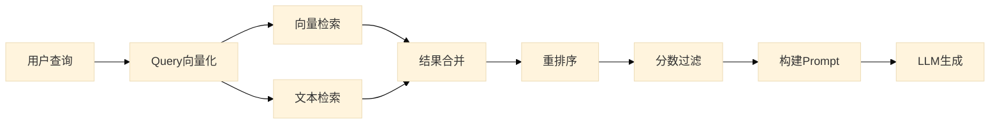

### 4.2 Agent 模块

Agent 模块负责工具调用和智能决策，是 GaussMaster 与 DBMind 平台交互的桥梁。

**核心组件：**

| 组件 | 文件路径 | 职责 |
|------|----------|------|
| DBA Agent | `multiagents/agents/dba.py` | 主 Agent，处理工具交互和故障诊断 |
| BaseAgent | `multiagents/agents/base_agent.py` | Agent 基类 |
| LLM Executor | `llms/executor.py` | LLM 调用和工具参数提取 |
| Tools Registry | `multiagents/tools/base_tools.py` | 工具注册中心 |
| DBMind Interface | `multiagents/tools/dbmind_interface.py` | DBMind API 封装 |

**Agent 决策流程：**

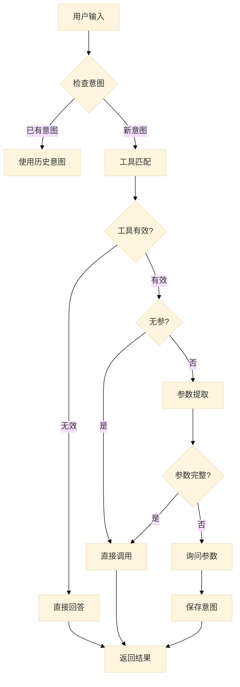

### 4.3 Memory 模块

Memory 模块负责管理用户会话历史和 QA 记录，支持多轮对话的上下文理解。

**核心组件：**

| 组件 | 文件路径 | 职责 |
|------|----------|------|
| InteractionMemory | `common/metadatabase/schema/interaction_memory.py` | 交互记录数据模型 |
| DAO Memory | `common/metadatabase/dao/dao_interaction_memory.py` | 记忆数据访问对象 |
| Session History | `global_vars.py` | 全局会话历史缓存 |

**Memory 层级结构：**

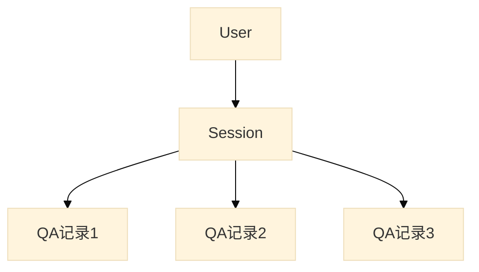

**数据库存储结构：**

```python
class InteractionMemory:
    qa_record_id: str      # 记录唯一ID
    user_id: str           # 用户ID
    session_id: str        # 会话ID
    question: str          # 问题（加密存储）
    answer: str            # 回答（加密存储）
    llm_name: str          # 使用的LLM
    function_call: str     # 工具调用信息（加密）
    created_at: int        # 创建时间戳
```

### 4.4 FastAPI 服务模块

FastAPI 服务模块负责 HTTP 接口的暴露和请求处理。

**核心组件：**

| 组件 | 文件路径 | 职责 |
|------|----------|------|
| HttpService | `common/http/_service_impl.py` | FastAPI 服务封装 |
| Core Controller | `controllers/core.py` | API 路由和控制器 |
| Data Transformer | `server/web/data_transformer.py` | 数据转换和业务逻辑 |
| Context Manager | `server/web/context_manager.py` | 请求上下文管理 |

**API 分层：**

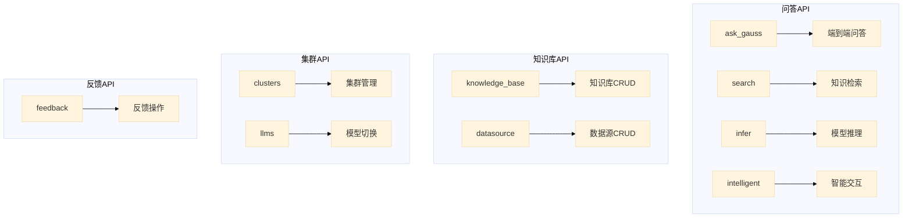

## 5. 数据流架构

### 5.1 文档入库数据流

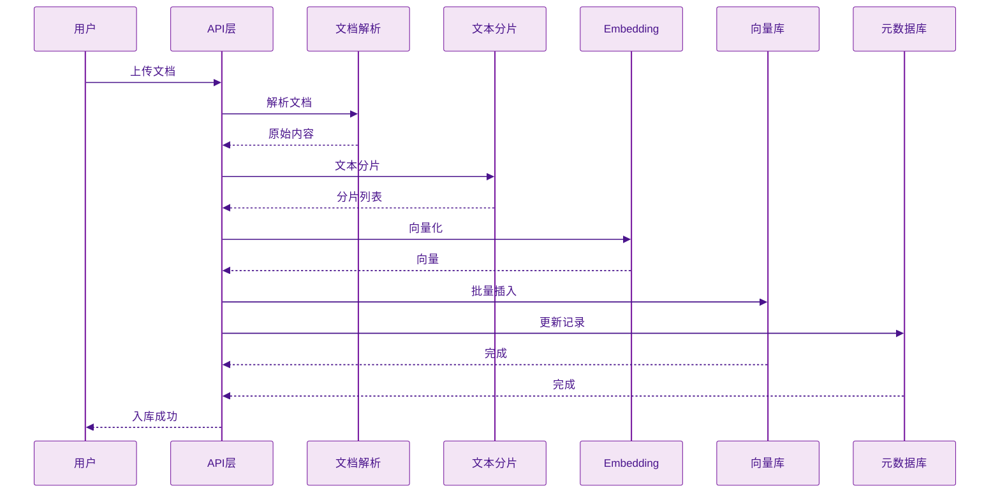

### 5.2 问答数据流

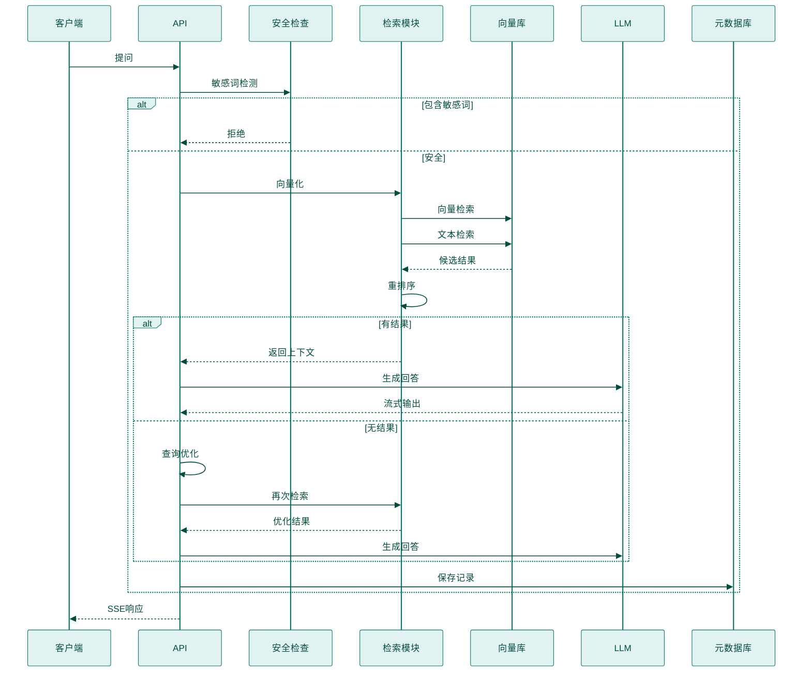

## 6. 配置体系

### 6.1 配置文件结构

```
gaussmaster.conf          # 主配置文件
model_config.yaml         # LLM 模型配置

# 配置分类：
[LOG]                     # 日志配置
[WEB_SERVICE]             # Web 服务配置
[VECTOR]                  # 向量数据库配置
[DBMIND]                  # DBMind 连接配置
[SAFETY]                  # 安全检查配置
```

### 6.2 配置加载流程

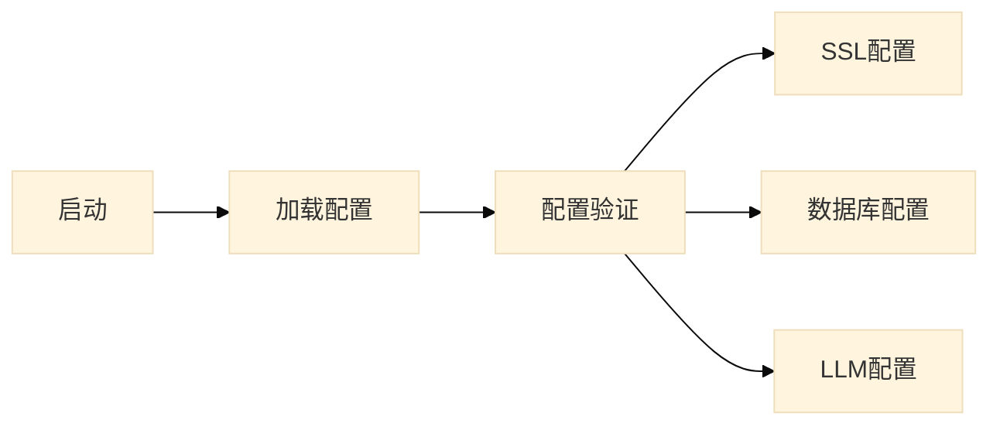

## 7. 安全架构

### 7.1 安全机制

| 层级 | 机制 | 实现 |
|------|------|------|
| 传输层 | SSL/TLS | Uvicorn SSL 配置 |
| 应用层 | 敏感词检测 | DFA 算法 |
| 数据层 | 加密存储 | AES256-CBC |
| 访问层 | 密码强度检查 | 正则验证 |

### 7.2 敏感数据处理

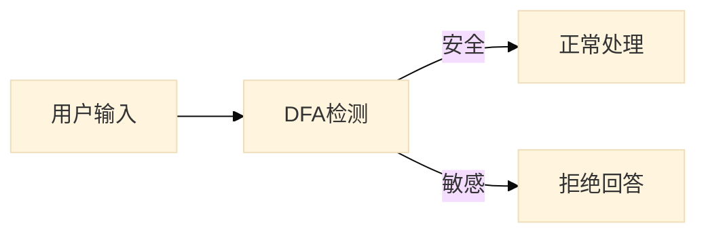

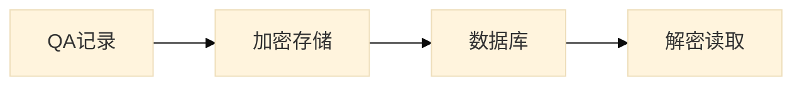

## 8. 扩展性设计

### 8.1 LLM 扩展

```python
# LLM 注册表模式
llm_registry = {
    'pangu': PanguLLM,
    'pangu_cloud': PanguCloudLLM,
    'chatglm': ChatGLM,
    'llama': Llama,
    'baichuan': Baichuan
}
```

### 8.2 工具扩展

```python
# 工具装饰器模式
@base_tools(
    name="tool_name",
    description="工具描述",
    params=[Param(...)]
)
def tool_function(**kwargs):
    pass
```

## 9. 部署架构

### 9.1 单机部署

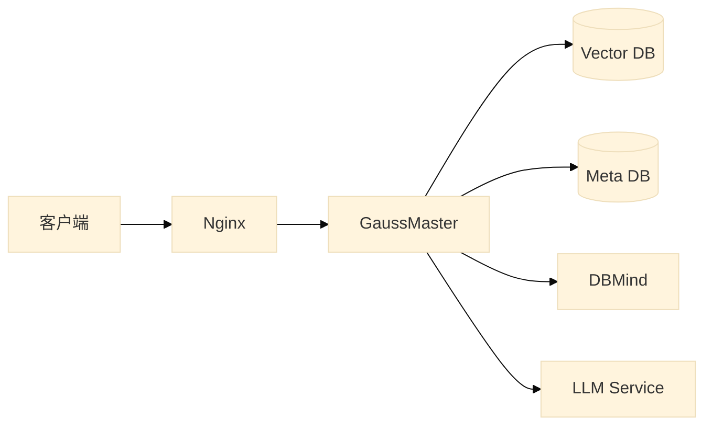

### 9.2 组件依赖

| 组件 | 依赖 | 说明 |
|------|------|------|
| GaussMaster | openGauss | 向量存储 |
| GaussMaster | PostgreSQL | 元数据存储 |
| GaussMaster | DBMind | 运维数据 |
| GaussMaster | LLM Service | 推理服务 |
| GaussMaster | Embedding | 向量化服务 |

## 10. 总结

GaussMaster 采用分层架构设计，核心特点：

1. **模块化设计**：各模块职责清晰，便于维护和扩展
2. **RAG + Agent 双引擎**：知识问答和工具调用能力兼备
3. **企业级特性**：SSL、加密、敏感词检测等安全机制完善
4. **多模型支持**：通过注册表模式支持多种 LLM
5. **流式响应**：支持 SSE 流式输出，提升用户体验

后续文档将详细展开各模块的具体实现和流程细节。
