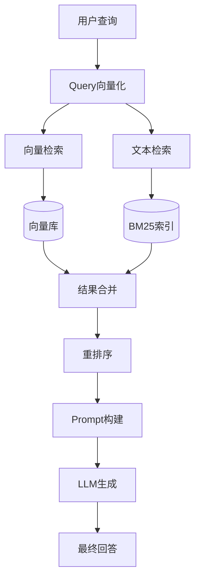
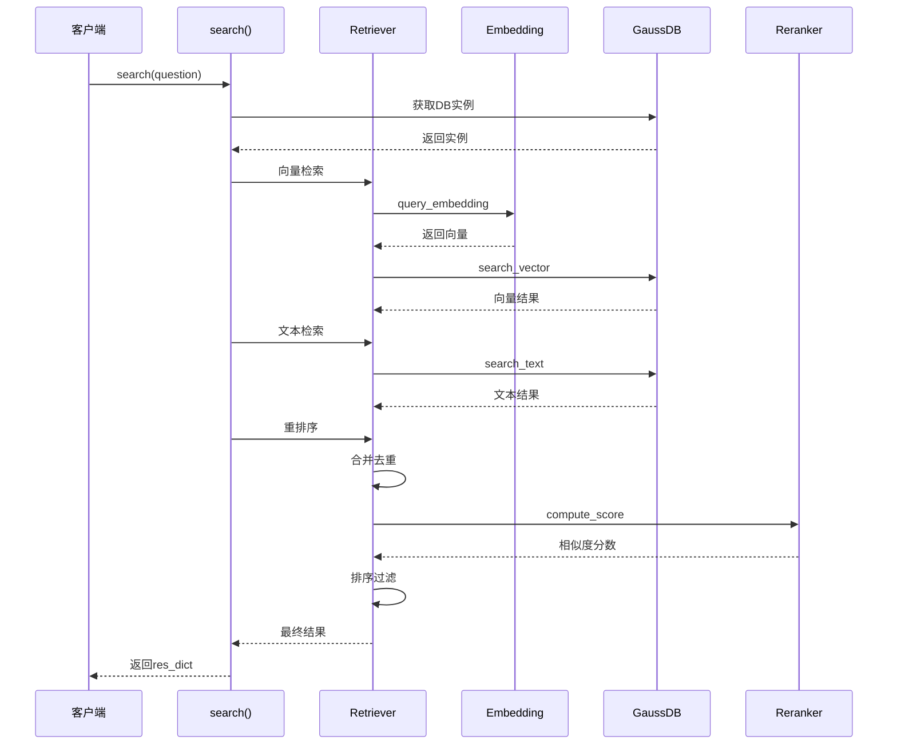
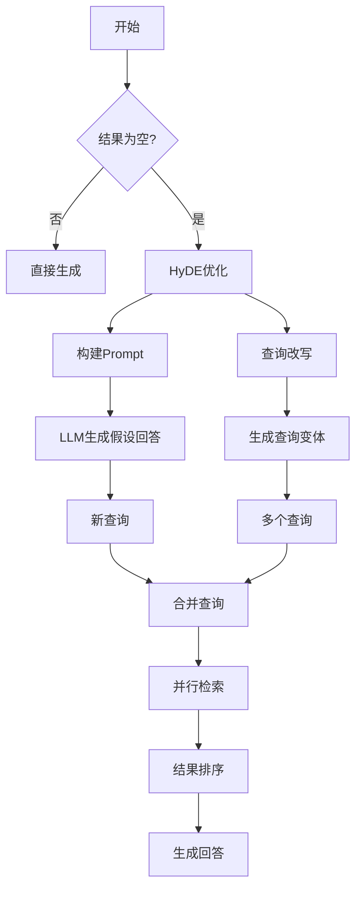
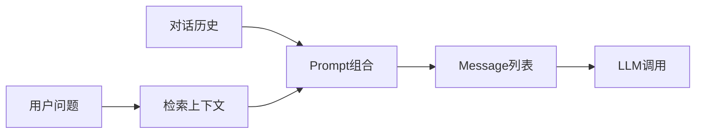
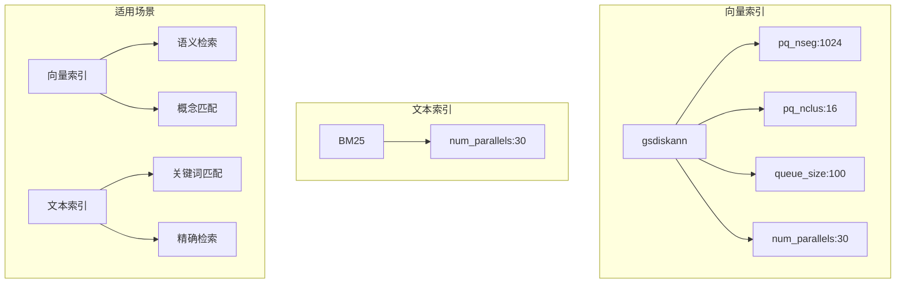

# GaussMaster RAG 流程详解

## 1. RAG 架构概述

RAG（Retrieval-Augmented Generation，检索增强生成）是 GaussMaster 的核心能力，通过结合向量检索、文本检索和大语言模型，实现准确的数据库知识问答。

### 1.1 设计目标

- **准确性**：通过检索相关知识，减少 LLM 幻觉
- **时效性**：支持动态知识库更新
- **可解释性**：返回知识来源，便于追溯
- **多路召回**：向量+文本双路检索，提高召回率

### 1.2 核心组件



## 2. 检索流程详解

### 2.1 整体检索流程



### 2.2 向量检索实现

```python
# utils/retriever_util.py - BaseRetriever

class BaseRetriever:
    async def search_vector_result_gaussdb(self, query, topk=3, version=""):
        """向量检索入口"""
        results = await self.gaussdb.search_vector(query, topk, version)
        return results
```

```python
# common/metadatabase/dao/gaussdb_vector.py - GaussDB

async def search_vector(self, query: str, topk: int, version="", embedding_key=None, distance=2):
    """执行向量检索 SQL"""
    if not embedding_key:
        embedding_key = self.embedding_keys[0]
    
    # 1. 获取查询向量
    embedding = await self.embedding_function.query_embedding(query)
    embedding_str = [str(num) for num in embedding]
    query_sql = '\'[' + ','.join(embedding_str) + ']\''
    
    # 2. 构建 SQL
    sql = f'SELECT * FROM "{escape_double_quote(self.db_index)}" '
    if version:
        sql += f'WHERE version=\'{escape_single_quote(version)}\' '
    # 使用 <-> 操作符计算 L2 距离
    sql += f'ORDER BY "{escape_double_quote(embedding_key + "_vector")}" <-> {query_sql} LIMIT {topk}'
    
    # 3. 执行查询
    self._connect()
    self.cur.execute(sql)
    result = self.cur.fetchall()
    self._close()
    return result
```

**设计要点：**

1. **向量存储**：使用 openGauss 的 floatvector 类型存储向量
2. **距离计算**：使用 `<->` 操作符计算 L2 距离
3. **索引加速**：使用 gsdiskann 索引加速向量检索
4. **版本过滤**：支持按版本过滤检索结果

### 2.3 文本检索实现

```python
# common/metadatabase/dao/gaussdb_vector.py - GaussDB

def search_text(self, query: str, topk: int, version=""):
    """执行 BM25 文本检索"""
    bm25_fields = ','.join(self.bm25_field)
    
    # 构建 BM25 检索 SQL
    sql = f'SELECT /*+ no tablescan("{escape_double_quote(self.db_index)}")*/ * FROM ' \
          f'"{escape_double_quote(self.db_index)}" '
    if version:
        sql += f'WHERE version=\'{escape_single_quote(version)}\' '
    # 使用 ### 操作符进行 BM25 相关性计算
    sql += f'ORDER BY "{escape_double_quote(bm25_fields)}" ### \'{escape_single_quote(query)}\' desc LIMIT {topk}'
    
    self._connect()
    self.cur.execute(sql)
    result = self.cur.fetchall()
    self._close()
    return result
```

**设计要点：**

1. **BM25 算法**：基于词频和文档长度的相关性评分
2. **索引提示**：使用 `/*+ no tablescan */` 强制使用索引
3. **多字段检索**：支持多个字段联合检索

### 2.4 重排序实现

```python
# utils/retriever_util.py - BaseRetriever

async def reranker_search_result(self, query, vector_result, text_result, topk=3):
    """重排序检索结果"""
    # 1. 合并去重
    sorted_scores, sorted_answer_list = await self.get_sorted_results(query, vector_result, text_result)
    
    # 2. 过滤负分结果
    res_score_list = []
    res_ans_list = []
    for index, answer in enumerate(sorted_answer_list):
        if sorted_scores[index] < 0:
            continue
        res_score_list.append(sorted_scores[index])
        res_ans_list.append(answer)
    
    # 3. 返回 topk 结果
    return res_score_list[:topk], res_ans_list[:topk]

async def get_sorted_results(self, query, vector_result, text_result):
    """获取排序后的结果"""
    # 合并去重
    dedup_list = list(set(vector_result + text_result))
    column_list = self.gaussdb.cols
    
    # 构建 query-document pairs
    pairs = []
    for result in dedup_list:
        pair = [query, result[column_list.index('text')]]
        pairs.append(pair)
    
    if not pairs:
        return [], []
    
    # 调用重排序服务
    scores = await self.reranker.compute_score(pairs)
    if not scores:
        return [], []
    
    # 按分数排序
    zipped = zip(scores, dedup_list)
    sort_zipped = sorted(zipped, key=lambda x: x[0], reverse=True)
    sort_result = zip(*sort_zipped)
    sorted_scores, sorted_answer_list = [list(x) for x in sort_result]
    
    return sorted_scores, sorted_answer_list
```

**设计要点：**

1. **结果融合**：合并向量检索和文本检索结果，去重
2. **精确排序**：使用专门的 Reranker 模型进行精确排序
3. **分数过滤**：过滤掉负分结果，提高结果质量
4. **Pair 构建**：构建 (query, document) pair 用于重排序

## 3. 查询优化流程（HyDE）

当直接检索无结果时，GaussMaster 会启动查询优化流程，使用 HyDE（Hypothetical Document Embeddings）技术。

### 3.1 HyDE 流程



### 3.2 HyDE 代码实现

```python
# server/web/data_transformer.py

async def query_opt_process(question, user_id, session_id, vector_topk, text_topk, rerank_topk,
                            kb_id, version, lang, history_len, history, model_name):
    """查询优化处理流程"""
    
    # 1. 提示无相关知识
    yield yield_progress_message('知识库无相关知识', 'No relevant knowledge found', lang)
    yield yield_progress_message('进行查询优化', 'Optimizing the query for better retrieval', lang)
    
    query_list = []
    
    # 2. HyDE: 生成假设性回答
    hyde_messages = get_hyde_prompt(question, [], lang)
    hyde_result = ""
    async for item in generate_answer(hyde_messages, model_name):
        hyde_result += item
    if hyde_result:
        query_list.append(hyde_result)
    
    yield yield_progress_message('假设性回答生成完成', 'Hypothetical answer generation completed.', lang)
    
    # 3. 查询改写
    query_trans_messages = get_query_transform_prompt(question, [], lang)
    query_trans_result = ""
    async for item in generate_answer(query_trans_messages, model_name):
        query_trans_result += item
    
    # 解析查询改写结果（有序列表格式）
    query_trans_results = query_trans_result.split('\n')
    for sub_query in query_trans_results:
        query_match = re.search(ORDER_LIST_PATTERN, sub_query)
        if query_match:
            query_list.append(sub_query[query_match.span()[1]:].strip())
    
    yield yield_progress_message(f'查询优化后相关问题生成完成，数量为{len(query_list)}', 
                                  f'Query optimization completed. Found {len(query_list)} relevant questions', lang)
    
    # 4. 多查询并行检索
    score_list = []
    res_list = []
    for query in query_list:
        res_dict = await search(query, user_id, session_id, vector_topk, text_topk, 
                               rerank_topk, kb_id, version, lang, history_len)
        search_res = res_dict.get('search_res', [])
        for answer in search_res:
            score_list.append(answer['score'])
            res_list.append(answer)
    
    # 5. 结果排序
    if res_list:
        zipped = zip(score_list, res_list)
        sort_zipped = sorted(zipped, key=lambda x: x[0], reverse=True)
        sort_result = zip(*sort_zipped)
        _, sorted_list = [list(x) for x in sort_result]
        sorted_list = sorted_list[:rerank_topk]
        
        # 6. 生成回答
        async for item in llm_generation(question, sorted_list, model_name, history, lang):
            yield item
    else:
        # 仍无结果，返回提示
        yield {'type': 'answer', 'data': '无法从知识库中检索到相关知识...'}
```

### 3.3 Prompt 设计

**HyDE Prompt：**

```python
# utils/prompt_util.py

def get_hyde_prompt(question, history, lang):
    """HyDE Prompt: 让 LLM 生成假设性回答"""
    if lang == "zh":
        system_prompt = """你是一个专业的数据库助手。请根据用户的问题，生成一个假设性的详细回答。
这个回答应该包含可能相关的技术细节和解决方案。
请用中文回答。"""
    else:
        system_prompt = """You are a professional database assistant. Please generate a hypothetical detailed answer 
based on the user's question. This answer should include possible technical details and solutions."""
    
    messages = [
        {"role": "system", "content": system_prompt},
        {"role": "user", "content": question}
    ]
    return messages
```

**Query Transform Prompt：**

```python
def get_query_transform_prompt(question, history, lang):
    """查询改写 Prompt: 生成多个相关查询"""
    if lang == "zh":
        system_prompt = """你是一个查询优化专家。请将用户的问题改写成多个不同的查询表述，
以提高在知识库中的检索效果。请输出 3-5 个不同的查询变体，使用有序列表格式。"""
    else:
        system_prompt = """You are a query optimization expert. Please rewrite the user's question into 
multiple different query expressions to improve retrieval effectiveness. Output 3-5 variations 
as an ordered list."""
    
    messages = [
        {"role": "system", "content": system_prompt},
        {"role": "user", "content": question}
    ]
    return messages
```

## 4. Prompt 构建与 LLM 交互

### 4.1 Prompt 构建流程



### 4.2 Prompt 代码实现

```python
# utils/prompt_util.py

def get_infer_prompt(question, context_list, history, lang):
    """构建推理 Prompt"""
    if lang == "zh":
        system_prompt = """你是 GaussDB 数据库专家助手。请基于提供的参考资料回答用户问题。
如果参考资料不足以回答问题，请明确说明。

参考资料：
{context}

请用中文回答，保持专业、准确、简洁。"""
    else:
        system_prompt = """You are a GaussDB database expert assistant. Please answer the user's question 
based on the provided reference materials. If the reference materials are insufficient, please state clearly.

Reference Materials:
{context}

Please answer in English, be professional, accurate, and concise."""
    
    # 拼接上下文
    context = "\n\n".join([f"[{i+1}] {ctx}" for i, ctx in enumerate(context_list)])
    
    messages = []
    
    # 添加历史对话
    for h in history:
        messages.append({"role": "user", "content": h['question']})
        messages.append({"role": "assistant", "content": h['answer']})
    
    # 添加当前问题
    messages.append({"role": "user", "content": question})
    
    # 构建完整 Prompt
    full_prompt = system_prompt.format(context=context)
    messages.insert(0, {"role": "system", "content": full_prompt})
    
    return messages
```

### 4.3 LLM 调用流程

```python
# server/web/data_transformer.py

async def generate_answer(messages, model_name):
    """生成回答"""
    if global_vars.local_llm:
        # 使用本地 LLM
        async for item in global_vars.local_llm.invoke(messages):
            yield item
    else:
        # 使用在线 LLM 服务
        params = {'messages': messages}
        headers = {
            "Accept": "text/event-stream",
            "Connection": "keep-alive",
            "Cache-Control": "no-cache"
        }
        url = global_vars.llm_config.get('online_llm').get(model_name).get('api_url')
        
        # 检查服务可用性
        is_valid, _, msg = check_url_connectivity(url, get_ssl_context(), model_name)
        if not is_valid:
            raise ApiClientException(msg)
        
        # 流式请求 LLM
        llm_generator = await thread_request_from_llm(url, headers, params)
        while True:
            chunk = await asyncio.get_running_loop().run_in_executor(
                None, iter_next, llm_generator
            )
            if chunk == -1:
                break
            yield chunk
```

## 5. 向量数据库设计

### 5.1 表结构设计

```sql
-- 知识表结构（KT_TABLE）
CREATE TABLE IF NOT EXISTS "knowledge_table" (
    "uuid" TEXT,                    -- 文档唯一ID
    "text" TEXT,                    -- 文档内容
    "text_vector" floatvector(1024), -- 文档向量
    "title" TEXT,                   -- 文档标题
    "field" TEXT,                   -- 领域
    "sub_field" TEXT,               -- 子领域
    "source" TEXT,                  -- 来源
    "version" TEXT,                 -- 版本
    "product_format" TEXT,          -- 产品格式
    "doc_location" TEXT,            -- 文档位置
    "visualize" TEXT,               -- 可视化标记
    "link" TEXT,                    -- 链接
    "context" TEXT,                 -- 上下文
    "keyword" TEXT,                 -- 关键词
    "confidence" TEXT,              -- 置信度
    "prev_uuid" TEXT,               -- 前一片段UUID
    "next_uuid" TEXT                -- 后一片段UUID
) with (orientation=ROW, storage_type=astore);

-- 创建向量索引
CREATE INDEX ON "knowledge_table" USING gsdiskann(
    "text_vector" l2
) WITH (
    pq_nseg=1024,
    pq_nclus=16,
    queue_size=100,
    num_parallels=30,
    enable_pq=true
);

-- 创建 BM25 文本索引
CREATE INDEX ON "knowledge_table" USING bm25(text) 
WITH (num_parallels=30);
```

### 5.2 索引策略



## 6. 性能优化策略

### 6.1 检索性能优化

| 优化点 | 实现方式 | 效果 |
|--------|----------|------|
| 向量索引 | gsdiskann | 加速向量检索 |
| 文本索引 | BM25 | 加速文本检索 |
| 并行检索 | 向量+文本并行 | 减少等待时间 |
| 结果缓存 | 会话级缓存 | 减少重复检索 |
| 批量插入 | 1000条/批次 | 加速文档入库 |

### 6.2 查询优化策略

```python
# 性能监控代码示例
start_time = time.time()

# 向量检索
vector_result = await retriever.search_vector_result_gaussdb(question, vector_topk, version)
vector_time = time.time()

# 文本检索
text_result = retriever.search_text_result_gaussdb(question, text_topk, version)
text_time = time.time()

# 重排序
reranker_scores, reranker_result = await retriever.reranker_search_result(
    question, vector_result, text_result, rerank_topk
)
reranker_time = time.time()

# 记录耗时
res_dict['vector_search_time'] = round(vector_time - start_time, 6)
res_dict['text_search_time'] = round(text_time - vector_time, 6)
res_dict['rerank_search_time'] = round(reranker_time - text_time, 6)
```

## 7. 常见问题与注意事项

### 7.1 检索无结果

**原因分析：**

1. 知识库中确实没有相关知识
2. 查询表述与文档表述差异大
3. 向量/文本检索参数设置不当

**解决方案：**

1. 启用 HyDE 查询优化
2. 调整 topk 参数
3. 检查知识库覆盖范围

### 7.2 检索结果质量低

**原因分析：**

1. 重排序分数阈值设置不当
2. 向量模型与领域不匹配
3. 文档分片策略不合理

**解决方案：**

1. 调整 reranker 分数过滤阈值
2. 使用领域特定的 Embedding 模型
3. 优化文档分片策略

### 7.3 性能瓶颈

**常见瓶颈：**

1. **向量检索慢**：检查 gsdiskann 索引是否创建
2. **文本检索慢**：检查 BM25 索引是否创建
3. **重排序慢**：减少候选结果数量
4. **LLM 响应慢**：使用流式输出优化体验

## 8. 总结

GaussMaster 的 RAG 流程设计特点：

1. **多路召回**：向量检索 + 文本检索，提高召回率
2. **精确排序**：使用 Reranker 进行精确排序
3. **查询优化**：HyDE 技术解决检索失败问题
4. **流式输出**：提升用户体验
5. **性能监控**：全程记录各阶段耗时，便于优化

关键设计决策：

- 使用 openGauss + pgvector 作为向量数据库，与业务数据库统一
- 采用在线 Embedding/Reranker 服务，便于模型独立升级
- 双路检索结果合并去重后再重排序，平衡召回率和准确率
