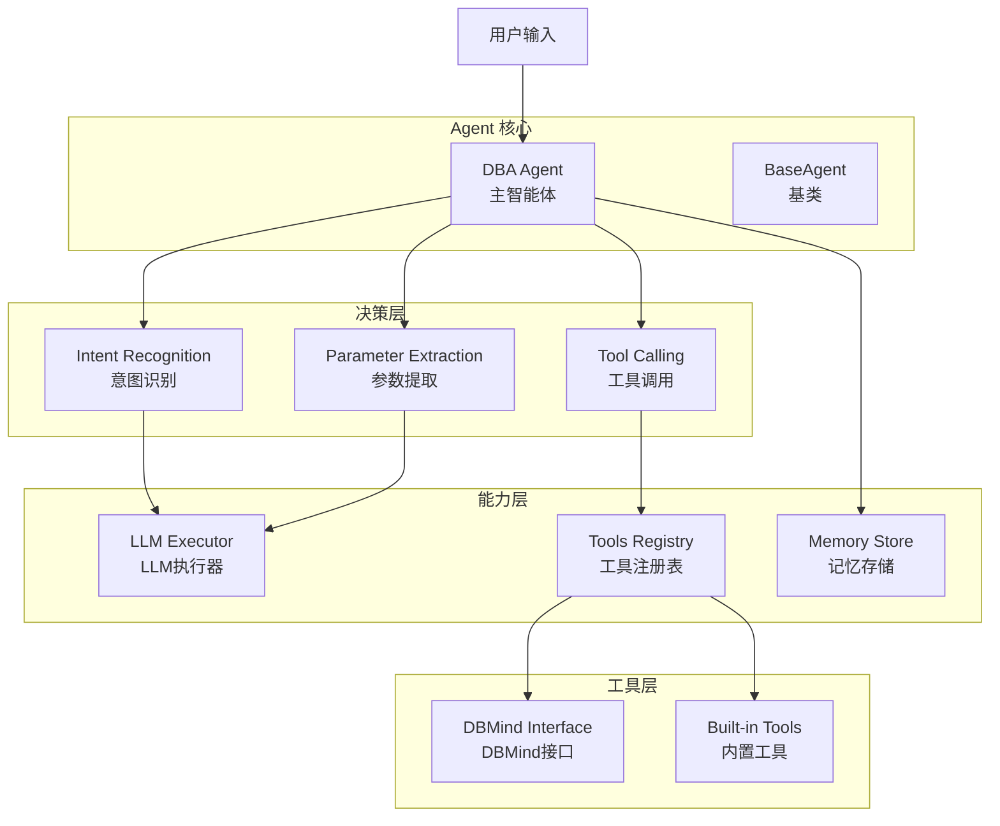
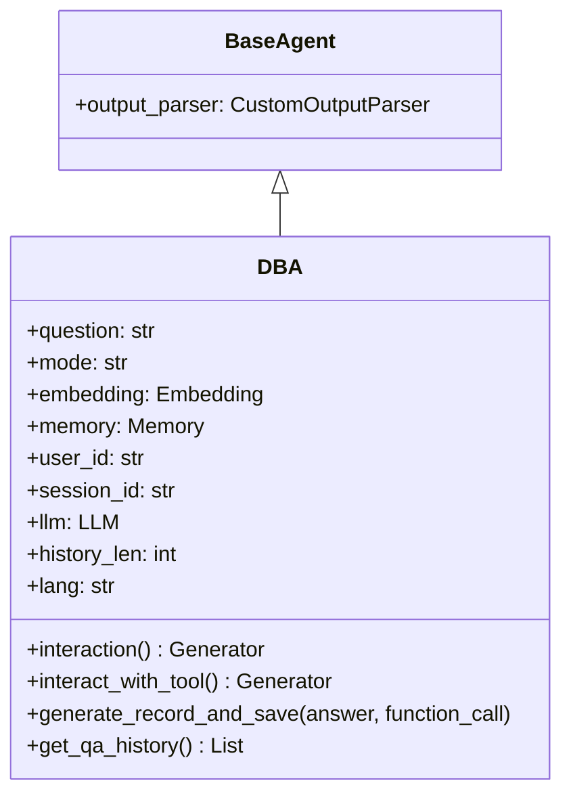
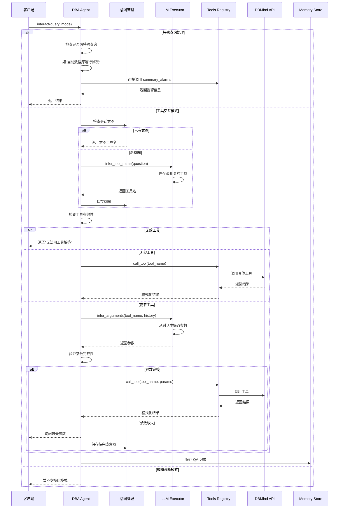
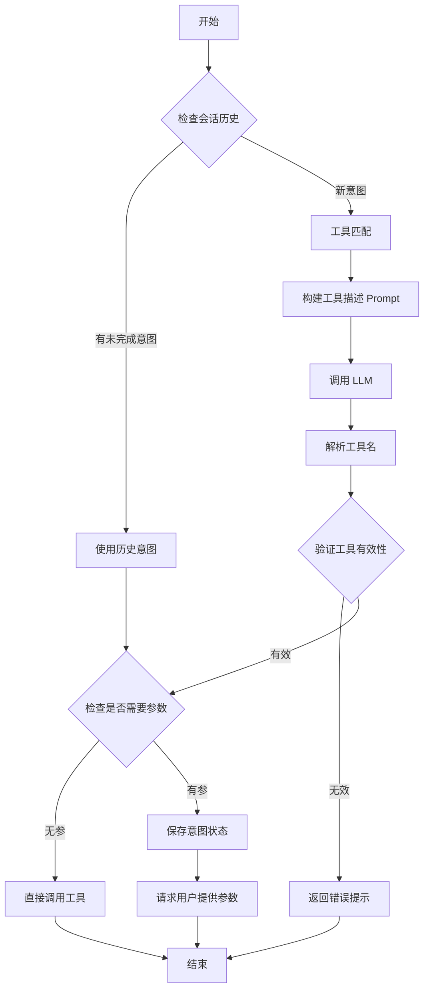
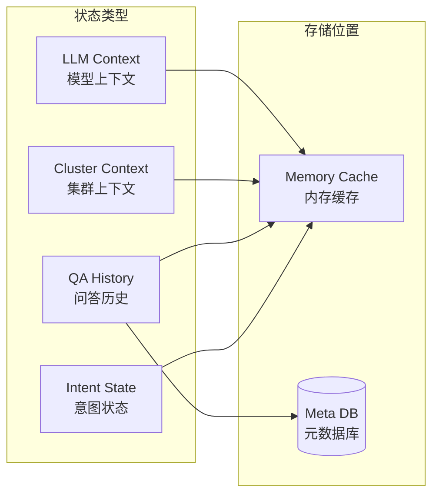
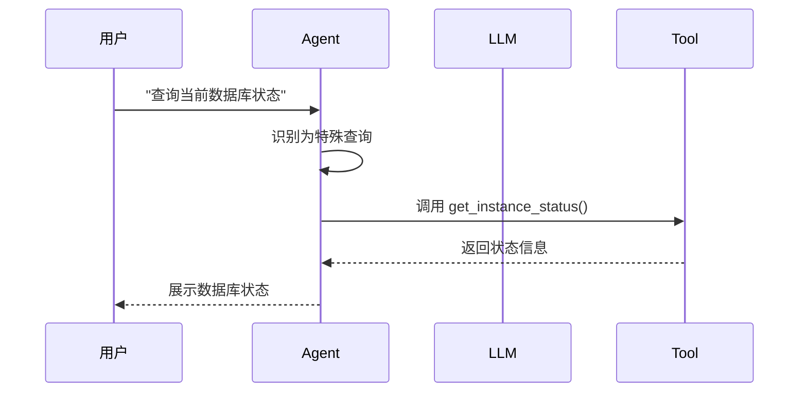
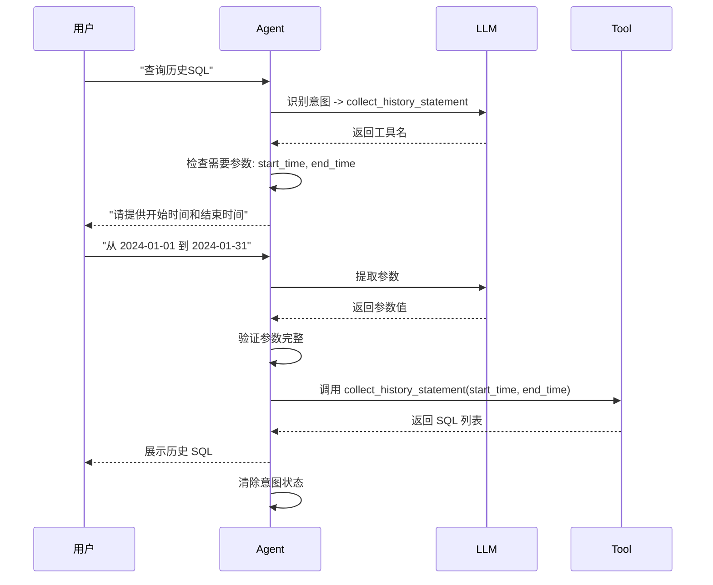
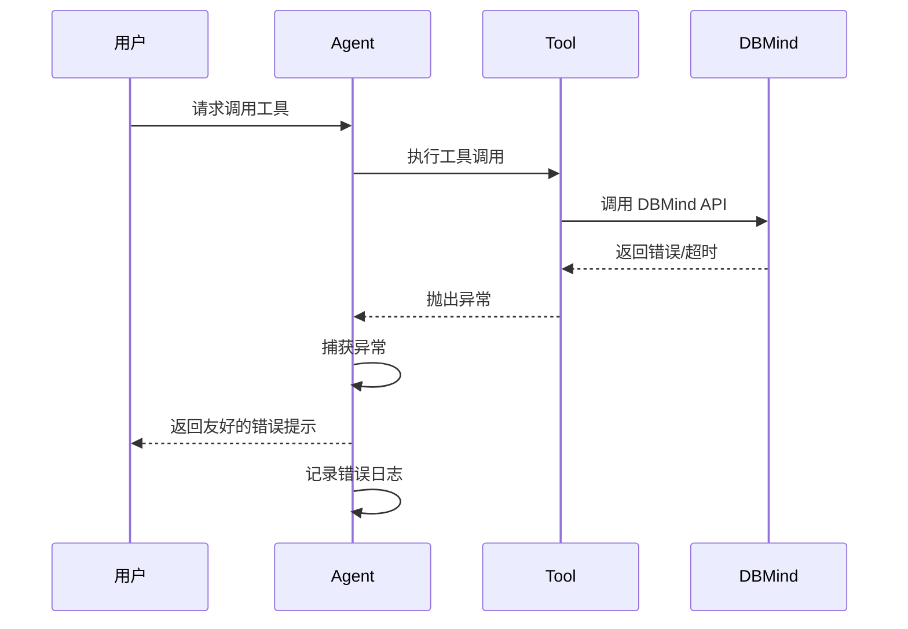
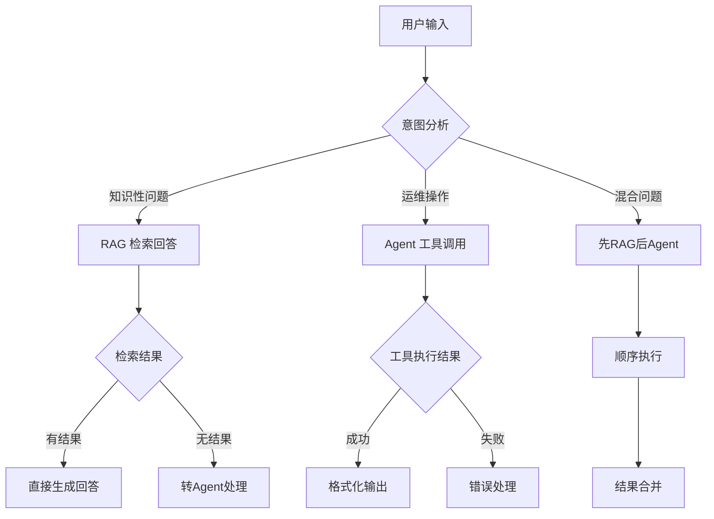

# GaussMaster Agent 流程详解

## 1. Agent 架构概述

GaussMaster 的 Agent 模块是一个智能决策系统，负责理解用户意图、调用外部工具（主要是 DBMind 数据库运维平台）、管理会话状态，实现数据库的智能运维交互。

### 1.1 设计目标

- **意图理解**：准确识别用户想要执行的操作
- **工具调用**：灵活调用 DBMind 提供的各种运维工具
- **状态管理**：维护多轮对话的上下文和意图状态
- **错误处理**：优雅处理工具调用失败和参数缺失情况

### 1.2 核心组件



## 2. Agent 整体结构设计

### 2.1 类层次结构



### 2.2 核心属性说明

| 属性 | 类型 | 说明 |
|------|------|------|
| `question` | str | 当前用户问题 |
| `mode` | str | 交互模式：`tool_interaction` 或 `fault_diagnostic` |
| `embedding` | Embedding | 向量化模型实例 |
| `memory` | Memory | 记忆存储实例 |
| `user_id` | str | 用户唯一标识 |
| `session_id` | str | 会话唯一标识 |
| `llm` | LLM | 大语言模型实例 |
| `history_len` | int | 历史对话轮数限制 |
| `lang` | str | 语言：zh/en |

## 3. Agent 决策流程

### 3.1 主交互流程



### 3.2 意图识别流程



## 4. 核心功能实现

### 4.1 工具意图识别

```python
# llms/executor.py

async def infer_tool_name(question: str, user_id, session_id, llm):
    """
    根据用户问题推断工具名称
    
    流程：
    1. 构建工具描述 Prompt
    2. 调用 LLM 进行意图匹配
    3. 返回匹配的工具名
    """
    # 根据 LLM 类型构建不同的工具描述格式
    if llm.llm_type == LLMType.PANGUCLOUD:
        _, detail_without_param_dict_list = base_tools.detail_dict_list
        tools_des = '\n'.join([
            json.dumps(tool_des, ensure_ascii=False) 
            for tool_des in detail_without_param_dict_list
        ])
        tools_des = tools_des.replace('{', '{{').replace('}', '}}')
    else:
        _, detail_without_param_str_list = base_tools.detail_str_list
        tools_des = '\n'.join(detail_without_param_str_list)
    
    # 构建系统 Prompt
    tools_des_prompt = (TOOL_DES_ZH.format(functions=tools_des) 
                       if LANGUAGE == 'zh' 
                       else TOOL_INTERACT_EN.format(functions=tools_des))
    
    message_input = [
        {LLMMsgKey.ROLE: LLMRole.SYSTEM, LLMMsgKey.CONTENT: tools_des_prompt},
        {LLMMsgKey.ROLE: LLMRole.USER, LLMMsgKey.CONTENT: question},
    ]
    
    # 检查是否有历史意图
    tool_name = global_vars.SESSION_TOOL_HISTORY.get(user_id, {}).get(session_id, None)
    if tool_name is None:
        # 调用 LLM 进行意图识别
        tool_name, _ = await llm.invoke(message_input)
        tool_name = tool_name.strip()
    
    return tool_name
```

**设计要点：**

1. **工具描述格式适配**：根据 LLM 类型（PanguCloud 或其他）使用不同的工具描述格式
2. **历史意图优先**：优先使用会话中保存的未完成意图
3. **Prompt 工程**：使用系统 Prompt 明确告知 LLM 工具列表和选择规则

### 4.2 工具参数提取

```python
# llms/executor.py

async def infer_arguments(question, intention_tool, qa_record_history, llm):
    """
    推断工具参数
    
    流程：
    1. 获取目标工具的详细描述（含参数定义）
    2. 构建参数提取 Prompt
    3. 调用 LLM 提取参数
    4. 验证参数完整性
    """
    # 获取工具详细描述
    if llm.llm_type == LLMType.PANGUCLOUD:
        target_tool_des = json.dumps(base_tools.get(intention_tool).__detail_with_param_dict__)
        target_tool_des = target_tool_des.replace('{', '{{').replace('}', '}}')
    else:
        target_tool_des = base_tools.get(intention_tool).__detail_with_param_str__
    
    # 构建时间参数
    tz = adjust_timezone(global_vars.configs.get('TIMEZONE', 'tz'))
    propose_prompt_dict = {
        "year": str(datetime.now(tz).year),
        "date": str(datetime.now(tz).date()),
        "current": str(datetime.now(tz).strftime('%Y-%m-%d %H:%M:%S')),
        "weekday": f"星期{WEEK_ZH[datetime.now(tz).weekday()]}" 
                   if LANGUAGE == 'zh' 
                   else WEEK_CN[datetime.now(tz).weekday()]
    }
    
    # 构建 Prompt
    propose_prompt_dict['functions'] = target_tool_des
    propose_prompt = (TOOL_INTERACT_ZH.format(**propose_prompt_dict) 
                     if LANGUAGE == 'zh' 
                     else TOOL_INTERACT_EN.format(**propose_prompt_dict))
    
    # 构建消息列表（包含历史对话）
    message_inputs = [{LLMMsgKey.ROLE: LLMRole.SYSTEM, LLMMsgKey.CONTENT: propose_prompt}]
    history = []
    for qa in qa_record_history:
        history.append({LLMMsgKey.ROLE: LLMRole.USER, LLMMsgKey.CONTENT: qa.question})
        answer_dict = {LLMMsgKey.ROLE: LLMRole.ASSISTANT, LLMMsgKey.CONTENT: qa.answer}
        if qa.function_call:
            answer_dict[LLMMsgKey.FUNCTION_CALL] = qa.function_call
        history.append(answer_dict)
    
    message_inputs.extend(history)
    message_inputs.append({LLMMsgKey.ROLE: LLMRole.USER, LLMMsgKey.CONTENT: question})
    
    # 调用 LLM 提取参数
    content_resp, function_call = await llm.invoke(message_inputs)
    
    return content_resp, function_call
```

**设计要点：**

1. **上下文感知**：利用历史对话帮助 LLM 理解当前语境
2. **时间感知**：注入当前时间信息，支持时间相关参数提取
3. **多轮对话支持**：通过历史 QA 记录维护对话上下文

### 4.3 参数验证

```python
# llms/executor.py

def verify_arguments(function_call: dict = None):
    """
    验证工具参数的完整性和正确性
    
    返回：
    1. is_complete_params: 参数是否完整
    2. correct_params: 正确的参数
    3. need_params: 缺失的参数
    """
    func_name = function_call.get('name')
    try:
        arguments = json.loads(function_call.get('arguments'))
    except TypeError:
        arguments = function_call.get('arguments')
    
    # 调用工具注册表的参数验证
    return has_correct_params(arguments, global_vars.tools_registry.get(func_name))


def has_correct_params(arguments, tool):
    """
    检查参数是否正确
    
    逻辑：
    1. 检查必填参数是否存在
    2. 检查参数类型是否匹配
    3. 返回缺失的参数列表
    """
    if not arguments:
        arguments = {}
    
    param_dict_list = tool.__param_dict_list__
    need_params = {}
    
    for param in param_dict_list:
        param_name = param.get('name')
        param_required = param.get('required', False)
        
        # 检查必填参数
        if param_required and param_name not in arguments:
            need_params[param_name] = param
    
    is_complete = len(need_params) == 0
    return is_complete, arguments, need_params
```

## 5. 工具注册与管理

### 5.1 工具注册机制

```python
# multiagents/tools/base_tools.py

# 全局工具注册表
tools_registry = {}

def base_tools(name, description, params=None, roles=None):
    """
    工具装饰器
    
    用法：
    @base_tools(
        name="tool_name",
        description="工具描述",
        params=[Param(name="param1", description="参数1", param_type="str", required=True)],
        roles=[AgentRoles.Repairer.name]
    )
    def tool_function(**kwargs):
        pass
    """
    def decorator(func):
        # 注册工具元数据
        func.__tool_name__ = name
        func.__tool_description__ = description
        func.__param_dict_list__ = params or []
        func.__tool_roles__ = roles or []
        
        # 构建工具描述字符串（用于 Prompt）
        param_str_list = []
        for param in func.__param_dict_list__:
            param_str = f"{param['name']}: {param['param_type']}"
            if param.get('required'):
                param_str += " (required)"
            param_str += f" - {param['description']}"
            param_str_list.append(param_str)
        
        func.__detail_with_param_str__ = f"{name}: {description}\n参数: {', '.join(param_str_list)}"
        func.__detail_without_param_str__ = f"{name}: {description}"
        
        # 注册到全局注册表
        tools_registry[name] = func
        
        return func
    return decorator
```

### 5.2 工具定义示例

```python
# multiagents/tools/dbmind_interface.py

@base_tools(
    name="collect_history_statement",
    description="collect_history_statement工具的功能是获取指定时间范围内的历史SQL列表，"
                "collect_history_statement工具有2个必要参数start_time和end_time。",
    params=[
        Param(name="start_time",
              description="必要参数，通过SQL语句的开始时间对SQL语句进行筛选，格式为%Y-%m-%d %H:%M:%S",
              param_type="str"),
        Param(name="end_time",
              description="必要参数，通过SQL语句的结束时间对SQL语句进行筛选，格式为%Y-%m-%d %H:%M:%S",
              param_type="str"),
        Param(name="database", 
              description="非必要参数，通过SQL语句运行的数据库名对SQL语句进行筛选，未指定则默认None",
              param_type="str", 
              required=False),
    ]
)
@validate_return_format
def collect_history_statement(start_time: str, end_time: str, database: Optional[str] = None):
    """获取历史 SQL 语句"""
    from_timestamp, to_timestamp = transfer_date_2_timestamp(start_time, end_time)
    params = {
        "data_source": "dbe_perf.statement_history",
        "databases": database,
        "start_time": from_timestamp,
        "end_time": to_timestamp
    }
    return workload_collection_call(params)
```

### 5.3 工具调用执行

```python
# llms/executor.py

@timer_decorator
def call_tool(tool_name: str, params=None):
    """
    执行工具调用
    
    流程：
    1. 从注册表获取工具函数
    2. 传入参数执行
    3. 返回执行结果
    """
    if params is None:
        params = {}
    
    # 获取工具函数
    tool_func = global_vars.tools_registry.get(tool_name)
    if not tool_func:
        raise ValueError(f"Tool {tool_name} not found")
    
    # 执行工具
    function_result = tool_func(**params)
    return function_result
```

## 6. 会话状态管理

### 6.1 意图状态存储

```python
# global_vars.py

# 会话工具意图历史
# 结构：{user_id: {session_id: tool_name}}
SESSION_TOOL_HISTORY = defaultdict(dict)

# QA 历史记录
# 结构：{user_id: {session_id: [QARecord1, QARecord2, ...]}}
SESSION_QA_HISTORY = {}
```

### 6.2 状态管理流程



### 6.3 意图保存与恢复

```python
# multiagents/agents/dba.py

async def save_assistant_resp(self, content_resp, intent_tool: str = None, 
                              tool_name: str = None, tool_params: dict = None):
    """
    保存助手响应并更新会话状态
    
    逻辑：
    1. 保存意图状态（如果有未完成的意图）
    2. 保存 QA 记录
    3. 保存工具调用记录
    """
    # 保存意图状态
    global_vars.SESSION_TOOL_HISTORY.update({
        self.user_id: {self.session_id: intent_tool}
    })
    
    # 构建工具调用记录
    if tool_name:
        function_call = {
            'tool_name': tool_name,
            'arguments': tool_params if tool_params else {}
        }
        await self.generate_record_and_save(content_resp, json.dumps(function_call))
    else:
        await self.generate_record_and_save(content_resp, None)
```

## 7. 典型交互场景

### 7.1 单轮工具调用



### 7.2 多轮参数收集



### 7.3 工具调用失败处理



## 8. 与 RAG 的协同

### 8.1 决策逻辑

Agent 和 RAG 是 GaussMaster 的两个核心能力，它们的协同决策逻辑如下：



### 8.2 模式切换

```python
# controllers/core.py

@request_mapping(api_prefix + "/ask_gauss", method='POST', api=True)
def ask_gauss(search_params: SearchParams = None):
    """RAG 问答模式"""
    return data_transformer.ask_gauss(
        search_params.question,
        search_params.user_id,
        search_params.session_id,
        # ... 其他参数
    )

@request_mapping(api_prefix + "/app/intelligent-interaction", method='POST', api=True)
def intelligent_interaction_chat(query: PlanModel):
    """Agent 智能交互模式"""
    plan_model = dict(query)
    plan_model.update({'model_name': current_llm.get()})
    return dba.interact(**plan_model)
```

## 9. 错误处理与容错

### 9.1 异常分类

| 异常类型 | 说明 | 处理方式 |
|----------|------|----------|
| `ToolNotFound` | 工具不存在 | 返回提示，建议重新描述 |
| `ParamMissing` | 参数缺失 | 询问用户补充参数 |
| `ParamInvalid` | 参数无效 | 提示参数格式错误 |
| `ToolCallError` | 工具调用失败 | 返回友好错误信息 |
| `LLMError` | LLM 调用失败 | 降级处理或重试 |

### 9.2 异常处理代码

```python
# multiagents/agents/dba.py

@stream_exception_catcher
async def interaction(self):
    """带异常捕获的交互处理"""
    try:
        if self.mode == InteractionType.TOOL_INTERACTION:
            async for step in self.interact_with_tool():
                yield step
        elif self.mode == InteractionType.FAULT_DIAGNOSTIC:
            yield [formatter_str("暂不支持此模式")]
    except Exception as e:
        logging.error(f"Interaction error: {e}")
        yield [formatter_str(f"处理过程中出现错误: {str(e)}")]
```

## 10. 最佳实践

### 10.1 工具设计原则

1. **单一职责**：每个工具只做一件事
2. **参数明确**：必填参数和可选参数清晰区分
3. **描述详细**：工具描述要足够详细，便于 LLM 理解
4. **错误处理**：工具内部要做好异常处理

### 10.2 Prompt 工程建议

1. **角色明确**：在 Prompt 中明确 LLM 的角色
2. **示例引导**：提供工具选择的示例
3. **约束清晰**：明确输出格式和约束条件
4. **上下文丰富**：充分利用历史对话上下文

### 10.3 性能优化

1. **意图缓存**：相同问题直接复用意图
2. **并行调用**：独立的工具调用可以并行
3. **超时控制**：设置工具调用超时时间
4. **结果缓存**：工具结果可以短期缓存

## 11. 总结

GaussMaster 的 Agent 模块设计特点：

1. **意图驱动**：基于 LLM 的意图识别，准确理解用户需求
2. **状态管理**：完善的会话状态管理，支持多轮交互
3. **工具生态**：灵活的工具注册机制，易于扩展
4. **容错设计**：全面的异常处理，保证系统稳定性
5. **人机协作**：在自动化和人工确认之间找到平衡
