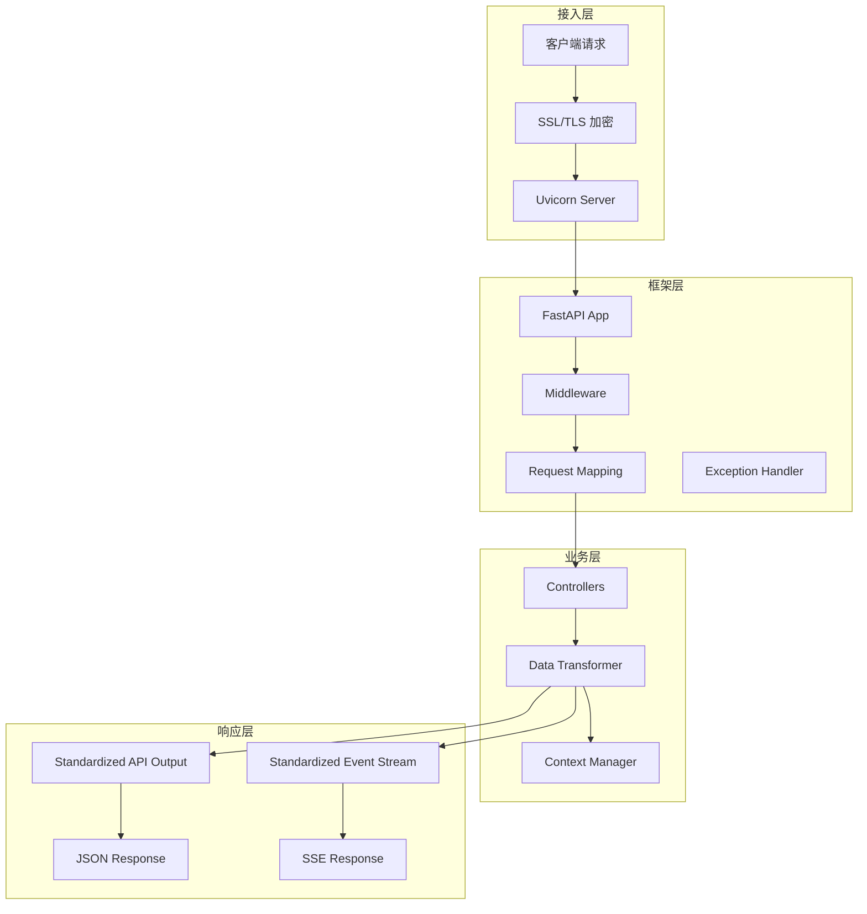
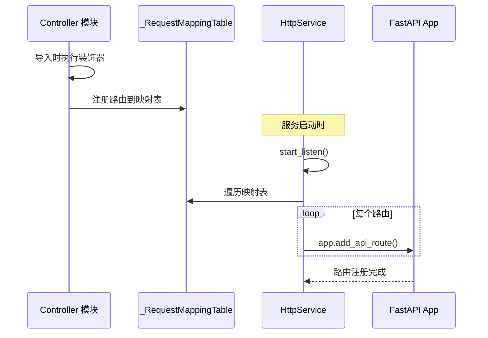
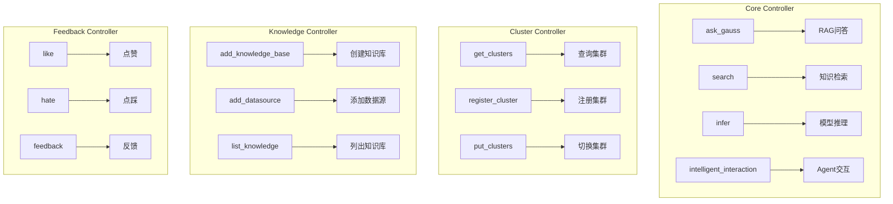

# GaussMaster FastAPI 服务封装详解

## 1. 服务架构概述

GaussMaster 使用 FastAPI 作为 Web 框架，通过分层封装实现 HTTP 服务的解耦和可扩展性。

### 1.1 架构分层



### 1.2 核心组件

| 组件 | 文件路径 | 职责 |
|------|----------|------|
| HttpService | `common/http/_service_impl.py` | FastAPI 服务封装和生命周期管理 |
| Controllers | `controllers/core.py` | API 路由和控制器实现 |
| Data Transformer | `server/web/data_transformer.py` | 业务逻辑处理和数据转换 |
| Context Manager | `server/web/context_manager.py` | 请求上下文管理 |

## 2. HttpService 封装

### 2.1 类设计

```python
# common/http/_service_impl.py

class HttpService:
    """
    FastAPI HTTP 服务封装类
    
    职责：
    1. FastAPI 应用实例管理
    2. 路由注册和管理
    3. 异常处理
    4. SSL/TLS 配置
    5. 服务生命周期管理
    """
    
    def __init__(self, name=__name__):
        # 禁用 OpenAPI 文档，提高安全性
        self.app = FastAPI(
            title=name, 
            openapi_url=None,  # 禁用 /openapi.json
            docs_url=None,     # 禁用 /docs
            redoc_url=None     # 禁用 /redoc
        )
        self._server = None
        self.need_to_exit = False
        self.rule_num = 0
        
        # 注册异常处理器
        self._register_exception_handlers()
        
        # 注册中间件
        self._register_middlewares()
```

### 2.2 路由注册机制



```python
# 全局路由映射表
_RequestMappingTable = dict()

def request_mapping(rule, method, **kwargs):
    """
    路由映射装饰器
    
    将函数注册到全局路由映射表
    支持在 HttpService 启动时批量注册
    """
    def decorator(f):
        _RequestMappingTable[(rule, method)] = (f, kwargs)
        return f
    return decorator

class HttpService:
    def attach(self, func, rule, method, **options):
        """将函数附加到 FastAPI 应用"""
        is_api = options.pop('api', False)
        # 转换路由参数格式 <param> -> {param}
        rule = rule.replace('<', '{').replace('>', '}')
        
        if is_api:
            self.app.add_api_route(rule, func, methods=[method], **options)
        else:
            self.app.add_route(rule, func, methods=[method], **options)
        self.rule_num += 1
```

### 2.3 服务启动流程

```python
class HttpService:
    def start_listen(self, host, port, 
                     ssl_keyfile=None, ssl_certfile=None,
                     ssl_keyfile_password=None, ssl_ca_file=None):
        """
        启动 HTTP 服务监听
        
        支持 HTTP 和 HTTPS 两种模式
        """
        # 创建自定义 Uvicorn Server 类
        class Server(uvicorn.Server):
            def install_signal_handlers(self) -> None:
                pass  # 禁用默认信号处理
            
            @contextlib.contextmanager
            def run_in_thread(self):
                thread = threading.Thread(target=self.run, name='WebServiceThread')
                thread.daemon = True
                thread.start()
                try:
                    while not this_service.need_to_exit:
                        time.sleep(0.001)
                    yield
                finally:
                    thread.join(5)
        
        # 批量注册路由
        for (rule, method), items in _RequestMappingTable.items():
            f, options = items
            self.attach(f, rule, method, **options)
        
        # 配置 Uvicorn
        config = uvicorn.Config(
            self.app, 
            host=host, 
            port=port,
            ssl_keyfile=ssl_keyfile, 
            ssl_certfile=ssl_certfile,
            ssl_keyfile_password=ssl_keyfile_password,
            ssl_ca_certs=ssl_ca_file,
            ssl_cert_reqs=ssl.CERT_REQUIRED,
            log_config=None
        )
        config.load()
        
        # SSL 安全配置
        if config.is_ssl:
            config.ssl.options |= (
                ssl.OP_NO_SSLv2 | ssl.OP_NO_SSLv3 | 
                ssl.OP_NO_TLSv1 | ssl.OP_NO_TLSv1_1
            )
            config.ssl.set_ciphers('DHE+AESGCM:ECDHE+AESGCM')
        
        self._server = Server(config)
        
        # 在后台线程运行服务
        with self._server.run_in_thread():
            pass
```

## 3. 控制器层设计

### 3.1 控制器结构



### 3.2 核心控制器实现

```python
# controllers/core.py

latest_version = 'v1'
api_prefix = '/%s/api' % latest_version

# ==================== RAG 问答接口 ====================

class SearchParams(BaseModel):
    """搜索参数模型"""
    question: str                    # 问题内容
    user_id: str                     # 用户ID
    session_id: str                  # 会话ID
    switch: bool = True              # 是否使用RAG
    vector_topk: int = 6             # 向量检索数量
    text_topk: int = 6               # 文本检索数量
    rerank_topk: int = 3             # 重排序数量
    kb_id: int = 0                   # 知识库ID
    version: str = None              # 版本
    model_name: str = "pangu_cloud"  # 模型名称
    lang: str = "zh"                 # 语言
    history_len: int = 1             # 历史长度
    model_config: dict = {}          # 模型配置
    search_res: List[Optional[dict]] = []  # 检索结果
    question_id: str = None          # 问题ID


@request_mapping(api_prefix + "/ask_gauss", method='POST', api=True)
@standardized_event_stream_output  # SSE 流式输出
@ParameterChecker.define_rules(search_params=ParameterChecker.SEARCH_PARAM)
@switch_llm_context_decorator       # LLM 上下文切换
def ask_gauss(search_params: SearchParams = None):
    """
    端到端 RAG 问答接口
    
    流程：
    1. 敏感词检测
    2. 知识检索（向量+文本+重排序）
    3. 查询优化（HyDE）
    4. LLM 生成回答
    5. 保存 QA 记录
    
    返回：SSE 流式响应
    """
    if not search_params:
        raise Exception(f'The search_params is None.')
    
    return data_transformer.ask_gauss(
        search_params.question,
        search_params.user_id,
        search_params.session_id,
        search_params.switch,
        search_params.vector_topk,
        search_params.text_topk,
        search_params.rerank_topk,
        search_params.kb_id,
        search_params.version,
        search_params.model_name,
        search_params.lang,
        search_params.history_len,
        search_params.model_config
    )


# ==================== Agent 交互接口 ====================

class PlanModel(BaseModel):
    """Agent 交互参数模型"""
    query: str           # 用户查询
    user_id: str         # 用户ID
    session_id: str      # 会话ID
    mode: str            # 模式：tool_interaction / fault_diagnostic
    history_len: int = 1 # 历史长度


@request_mapping(api_prefix + "/app/intelligent-interaction", method='POST', api=True)
@standardized_event_stream_output
@ParameterChecker.define_rules(query=ParameterChecker.QUERY_MODEL)
@switch_llm_context_decorator
def intelligent_interaction_chat(query: PlanModel):
    """
    智能交互接口（Agent 模式）
    
    流程：
    1. 意图识别
    2. 工具匹配
    3. 参数提取
    4. 工具调用
    5. 结果返回
    
    返回：SSE 流式响应
    """
    plan_model = dict(query)
    plan_model.update({'model_name': current_llm.get()})
    return dba.interact(**plan_model)
```

## 4. 响应标准化

### 4.1 API 响应标准化

```python
# common/http/_service_impl.py

def standardized_api_output(f):
    """
    API 响应标准化装饰器
    
    统一响应格式：
    {
        "success": true/false,
        "data": {...} 或 "msg": "错误信息"
    }
    """
    class ToleratedEncoder(json.JSONEncoder):
        """容错编码器，处理特殊值（NaN, Infinity 等）"""
        def default(self, o):
            return str(o)
        
        def iterencode(self, o, _one_shot=False):
            try:
                return super().iterencode(o, _one_shot)
            except ValueError:
                # 处理 NaN 和 Infinity
                def floatstr(o_):
                    if o_ != o_:
                        return 'null'  # NaN
                    elif o_ == float('inf'):
                        return 'Infinity'
                    elif o_ == -float('inf'):
                        return '-Infinity'
                    return str(o_)
                # ... 重新编码
    
    class ToleratedJSONResponse(JSONResponse):
        def render(self, content) -> bytes:
            return json.dumps(
                content,
                ensure_ascii=False,
                allow_nan=False,
                indent=None,
                sort_keys=True,
                separators=(",", ":"),
                cls=ToleratedEncoder
            ).encode("utf-8")
    
    @wraps(f)
    async def async_wrapper(*args, **kwargs):
        try:
            data = await f(*args, **kwargs)
            return ToleratedJSONResponse(
                content={'success': True, 'data': data}
            )
        except HTTPException as e:
            raise e
        except Exception as e:
            logging.getLogger('uvicorn.error').exception(e)
            return ToleratedJSONResponse(
                content={'success': False, 'msg': f'Internal server error.'}
            )
    
    return async_wrapper
```

### 4.2 SSE 流式响应标准化

```python
def standardized_event_stream_output(f):
    """
    SSE 流式响应标准化装饰器
    
    数据格式：data:{"success": true, "data": ...}\n\n
    """
    @wraps(f)
    async def wrapper(*args, **kwargs):
        try:
            generator = f(*args, **kwargs)
            if isinstance(generator, str) or not generator:
                return generator
            
            async def standardize_generator():
                """标准化生成器"""
                try:
                    async for item in generator:
                        # 格式化为 SSE 格式
                        yield f"data:{json.dumps(
                            {'success': True, 'data': item}, 
                            ensure_ascii=False, 
                            sort_keys=True, 
                            separators=(',', ':')
                        )}\n\n"
                except Exception as e:
                    logging.getLogger('uvicorn.error').exception(e)
                    yield f"data:{json.dumps(
                        {'success': False, 'msg': 'Internal server error.'},
                        ensure_ascii=False
                    )}\n\n"
            
            return StreamingResponse(
                standardize_generator(), 
                media_type="text/event-stream"
            )
        except Exception as e:
            logging.getLogger('uvicorn.error').exception(e)
            error_message = f"data:{json.dumps(
                {'success': False, 'msg': 'Internal server error.'},
                ensure_ascii=False
            )}\n\n"
            return StreamingResponse(
                iter([error_message]), 
                media_type="text/event-stream"
            )
    
    return wrapper
```

## 5. 上下文管理

### 5.1 上下文管理器设计

```python
# server/web/context_manager.py

# 线程本地存储，用于保存当前请求上下文
_current_llm = contextvars.ContextVar('current_llm', default=None)
_current_instance = contextvars.ContextVar('current_instance', default=None)

class ContextManager:
    """上下文管理器"""
    
    @staticmethod
    def set_user_current_llm(user_id: str, model_name: str):
        """设置用户当前 LLM"""
        global_vars.user_session_llm[user_id] = model_name
    
    @staticmethod
    def get_user_current_llm(user_id: str) -> str:
        """获取用户当前 LLM"""
        return global_vars.user_session_llm.get(user_id)
    
    @staticmethod
    def set_user_current_instance(user_id: str, instance: str):
        """设置用户当前集群实例"""
        global_vars.user_session_instance[user_id] = instance


def switch_llm_context_decorator(f):
    """
    LLM 上下文切换装饰器
    
    根据 user_id 和 session_id 切换当前 LLM 上下文
    """
    @wraps(f)
    async def async_wrapper(*args, **kwargs):
        # 从参数中提取 user_id 和 session_id
        user_id = kwargs.get('user_id') or args[0].user_id
        session_id = kwargs.get('session_id') or args[0].session_id
        
        # 获取用户设置的 LLM
        model_name = global_vars.user_session_llm.get(user_id, {}).get(session_id)
        if model_name:
            current_llm.set(model_name)
        else:
            current_llm.set(global_vars.llm_config.get('model_name'))
        
        return await f(*args, **kwargs)
    
    return async_wrapper
```

### 5.2 语言中间件

```python
# common/http/_service_impl.py

class HttpService:
    def _register_middlewares(self):
        """注册中间件"""
        
        @self.app.middleware("http")
        async def set_language_middleware(request: Request, call_next):
            """
            语言设置中间件
            
            从请求头 Accept-Language 解析语言设置
            """
            accept_language = request.headers.get('Accept-Language', global_vars.LANGUAGE)
            global_vars.LANGUAGE = parse_accept_language(accept_language)
            response = await call_next(request)
            return response
```

## 6. 参数校验

### 6.1 参数校验装饰器

```python
# common/utils/checking.py

class ParameterChecker:
    """参数校验器"""
    
    # 预定义校验规则
    QUERY_MODEL = {
        'query': {'type': str, 'required': True},
        'user_id': {'type': str, 'required': True},
        'session_id': {'type': str, 'required': True},
    }
    
    SEARCH_PARAM = {
        'question': {'type': str, 'required': True, 'min': 1},
        'user_id': {'type': str, 'required': True},
        'session_id': {'type': str, 'required': True},
        'vector_topk': {'type': int, 'min': 1, 'max': 10},
        'text_topk': {'type': int, 'min': 1, 'max': 10},
        'rerank_topk': {'type': int, 'min': 1, 'max': 10},
    }
    
    @staticmethod
    def define_rules(**rules):
        """定义校验规则装饰器"""
        def decorator(f):
            @wraps(f)
            async def async_wrapper(*args, **kwargs):
                # 执行参数校验
                for param_name, rule in rules.items():
                    value = kwargs.get(param_name)
                    if rule.get('required') and value is None:
                        raise HTTPException(
                            status_code=400, 
                            detail=f'Parameter {param_name} is required'
                        )
                    if value is not None:
                        if not isinstance(value, rule.get('type')):
                            raise HTTPException(
                                status_code=400,
                                detail=f'Parameter {param_name} type error'
                            )
                return await f(*args, **kwargs)
            return async_wrapper
        return decorator
```

## 7. 简化版 FastAPI 服务示例

以下是一个简化但可运行的 FastAPI 服务示例，展示 GaussMaster 的核心封装模式：

```python
"""
simplified_fastapi_service.py
简化版 FastAPI 服务示例
"""

from fastapi import FastAPI, HTTPException, Request
from fastapi.responses import JSONResponse, StreamingResponse
from pydantic import BaseModel
from functools import wraps
import json
import asyncio
from typing import Optional, List

# ==================== 1. 响应标准化 ====================

def standardized_api_output(f):
    """API 响应标准化装饰器"""
    @wraps(f)
    async def async_wrapper(*args, **kwargs):
        try:
            data = await f(*args, **kwargs)
            return JSONResponse(content={'success': True, 'data': data})
        except HTTPException as e:
            raise e
        except Exception as e:
            return JSONResponse(
                content={'success': False, 'msg': str(e)},
                status_code=500
            )
    return async_wrapper


def standardized_event_stream_output(f):
    """SSE 流式响应标准化装饰器"""
    @wraps(f)
    async def wrapper(*args, **kwargs):
        async def generate():
            try:
                async for item in f(*args, **kwargs):
                    yield f"data:{json.dumps({'success': True, 'data': item})}\n\n"
            except Exception as e:
                yield f"data:{json.dumps({'success': False, 'msg': str(e)})}\n\n"
        
        return StreamingResponse(generate(), media_type="text/event-stream")
    return wrapper


# ==================== 2. 请求模型 ====================

class ChatRequest(BaseModel):
    """对话请求模型"""
    question: str
    user_id: str
    session_id: str
    history_len: int = 3


class SearchRequest(BaseModel):
    """检索请求模型"""
    question: str
    user_id: str
    session_id: str
    topk: int = 5


# ==================== 3. 业务逻辑层 ====================

class RAGService:
    """RAG 服务"""
    
    async def search(self, question: str, topk: int):
        """模拟检索"""
        await asyncio.sleep(0.1)
        return [
            {"content": f"知识片段 {i}", "score": 0.9 - i * 0.1}
            for i in range(topk)
        ]
    
    async def generate(self, question: str, context: list):
        """模拟流式生成"""
        answer = f"基于检索结果，{question} 的答案是..."
        for word in answer:
            yield {'type': 'answer', 'data': word}
            await asyncio.sleep(0.01)
        yield {'type': 'complete', 'data': {'time': 1.23}}


class AgentService:
    """Agent 服务"""
    
    async def interact(self, query: str, user_id: str, session_id: str):
        """模拟 Agent 交互"""
        yield {'type': 'progress', 'data': '工具匹配中...'}
        await asyncio.sleep(0.5)
        
        yield {'type': 'progress', 'data': '工具调用中...'}
        await asyncio.sleep(0.5)
        
        yield {'type': 'answer', 'data': f'工具执行结果：{query}'}
        yield {'type': 'complete', 'data': {'time': 1.0}}


# ==================== 4. FastAPI 应用 ====================

app = FastAPI(title="GaussMaster Simplified API")

rag_service = RAGService()
agent_service = AgentService()


# ==================== 5. API 路由 ====================

@app.post("/v1/api/chat")
@standardized_event_stream_output
async def chat(request: ChatRequest):
    """
    对话接口（RAG + Agent）
    
    示例请求：
    {
        "question": "如何优化 SQL？",
        "user_id": "user_001",
        "session_id": "session_001"
    }
    """
    # 1. 检索知识
    search_results = await rag_service.search(request.question, topk=3)
    
    # 2. 流式生成回答
    async for item in rag_service.generate(request.question, search_results):
        yield item


@app.post("/v1/api/search")
@standardized_api_output
async def search(request: SearchRequest):
    """
    检索接口
    
    示例请求：
    {
        "question": "SQL优化",
        "user_id": "user_001",
        "session_id": "session_001",
        "topk": 5
    }
    """
    results = await rag_service.search(request.question, request.topk)
    return {
        'search_res': results,
        'total': len(results)
    }


@app.post("/v1/api/agent/interact")
@standardized_event_stream_output
async def agent_interact(request: ChatRequest):
    """
    Agent 交互接口
    
    示例请求：
    {
        "question": "查询当前数据库状态",
        "user_id": "user_001",
        "session_id": "session_001"
    }
    """
    async for item in agent_service.interact(
        request.question, 
        request.user_id, 
        request.session_id
    ):
        yield item


# ==================== 6. 运行服务 ====================

if __name__ == "__main__":
    import uvicorn
    uvicorn.run(app, host="0.0.0.0", port=8000)
```

## 8. 接口清单

### 8.1 问答接口

| 接口 | 方法 | 说明 | 响应类型 |
|------|------|------|----------|
| `/v1/api/ask_gauss` | POST | 端到端 RAG 问答 | SSE |
| `/v1/api/search` | POST | 知识检索 | JSON |
| `/v1/api/infer` | POST | 模型推理 | SSE |

### 8.2 Agent 接口

| 接口 | 方法 | 说明 | 响应类型 |
|------|------|------|----------|
| `/v1/api/app/intelligent-interaction` | POST | 智能交互 | SSE |

### 8.3 知识库接口

| 接口 | 方法 | 说明 | 响应类型 |
|------|------|------|----------|
| `/v1/api/serve/knowledge_base/add` | POST | 创建知识库 | JSON |
| `/v1/api/serve/knowledge_base/list` | GET | 列出知识库 | JSON |
| `/v1/api/serve/knowledge_base/get` | GET | 获取知识库 | JSON |
| `/v1/api/serve/knowledge_base/update` | PUT | 更新知识库 | JSON |
| `/v1/api/serve/knowledge_base/delete` | DELETE | 删除知识库 | JSON |
| `/v1/api/serve/datasource/add` | POST | 添加数据源 | JSON |
| `/v1/api/serve/datasource/list` | GET | 列出数据源 | JSON |

### 8.4 集群管理接口

| 接口 | 方法 | 说明 | 响应类型 |
|------|------|------|----------|
| `/v1/api/clusters` | GET | 查询集群列表 | JSON |
| `/v1/api/clusters` | PUT | 切换集群 | JSON |
| `/v1/api/clusters/register` | POST | 注册集群 | JSON |

### 8.5 反馈接口

| 接口 | 方法 | 说明 | 响应类型 |
|------|------|------|----------|
| `/v1/api/feedback/like` | POST | 点赞 | JSON |
| `/v1/api/feedback/hate` | POST | 点踩 | JSON |
| `/v1/api/feedback` | POST | 提交反馈 | JSON |
| `/v1/api/feedback/report` | POST | 举报 | JSON |

## 9. 总结

GaussMaster 的 FastAPI 服务封装特点：

1. **分层解耦**：接入层、框架层、业务层清晰分离
2. **响应标准化**：统一的 JSON 和 SSE 响应格式
3. **装饰器模式**：通过装饰器实现横切关注点（校验、日志、上下文）
4. **流式支持**：原生支持 SSE 流式响应，提升用户体验
5. **类型安全**：使用 Pydantic 模型进行参数校验
6. **异常处理**：全局异常捕获和标准化错误响应
