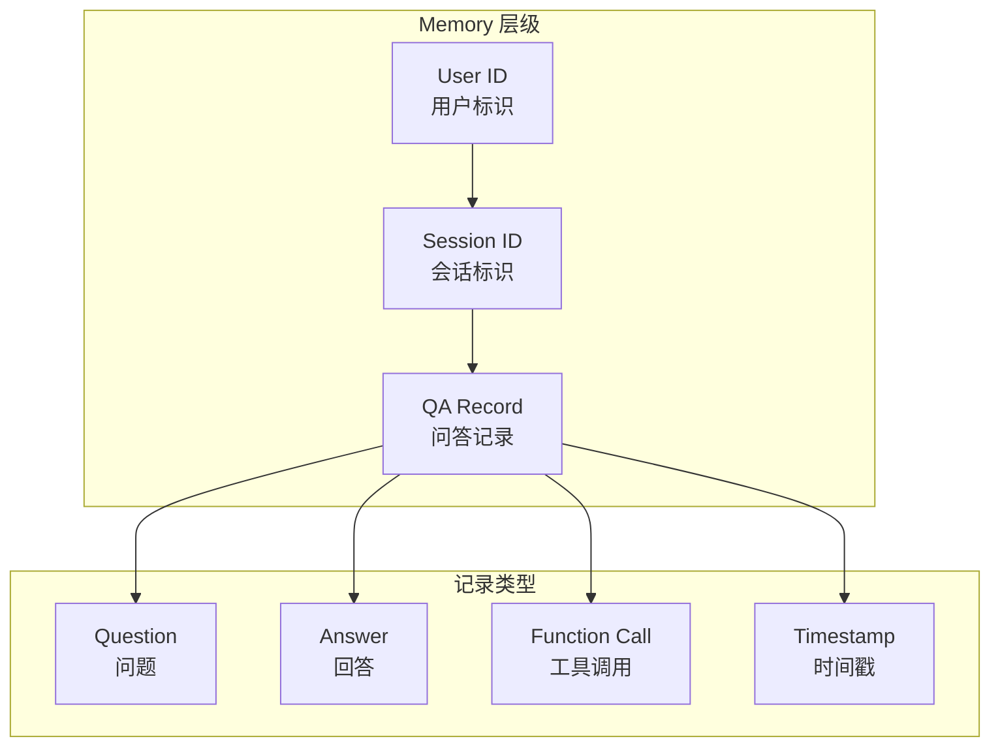
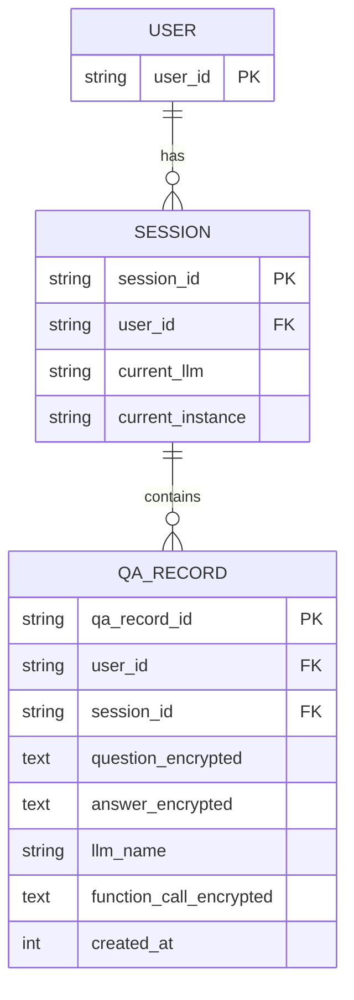
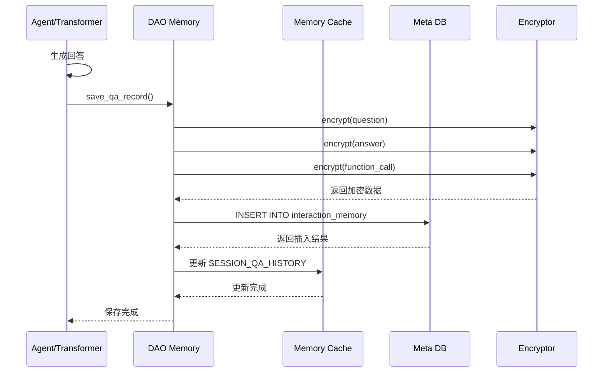
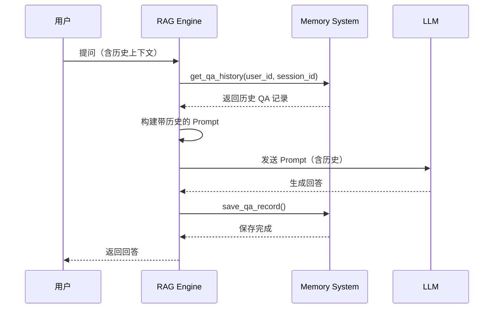
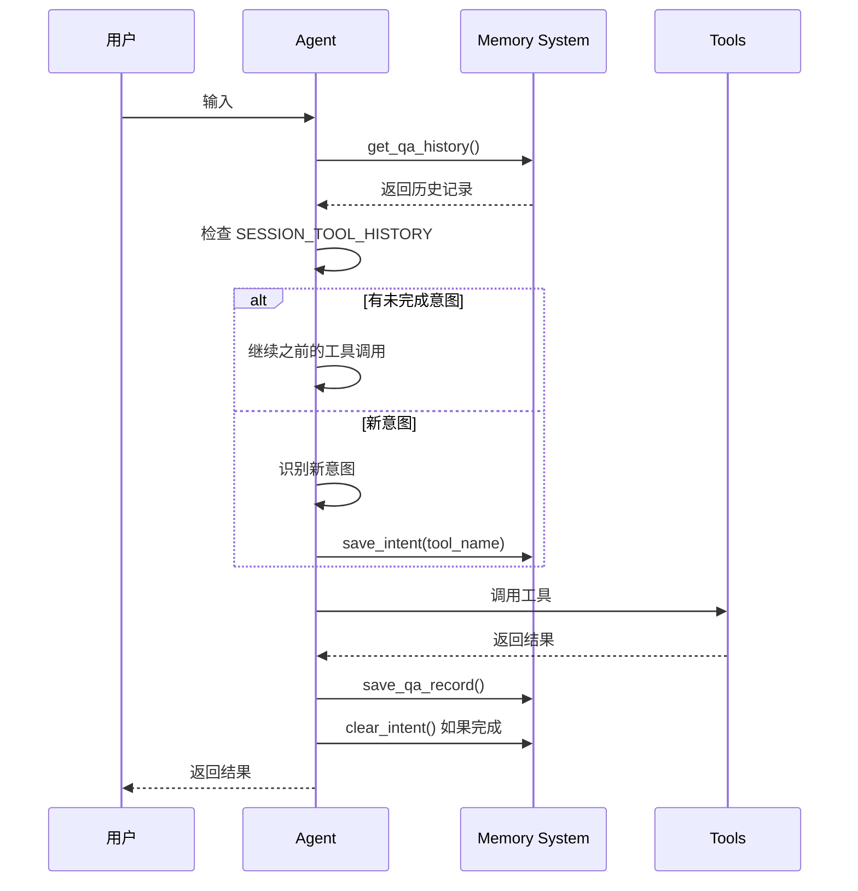
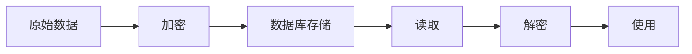

# GaussMaster Memory 系统详解

## 1. Memory 系统概述

Memory（记忆）系统是 GaussMaster 的核心组件之一，负责管理用户会话历史、QA 记录和工具调用状态，支持多轮对话的上下文理解和意图延续。

### 1.1 设计目标

- **会话连续性**：支持多轮对话，维护对话上下文
- **意图延续**：支持未完成的工具调用意图在后续对话中继续
- **历史追溯**：支持查询历史问答记录
- **数据安全**：敏感数据加密存储

### 1.2 核心概念



## 2. 数据结构设计

### 2.1 内存数据结构

```python
# global_vars.py

# 会话工具意图历史
# 结构：{user_id: {session_id: tool_name}}
# 用途：保存未完成的工具调用意图
SESSION_TOOL_HISTORY = defaultdict(dict)

# QA 历史记录（内存缓存）
# 结构：{user_id: {session_id: [QARecord1, QARecord2, ...]}}
# 用途：快速访问当前会话的问答历史
SESSION_QA_HISTORY = {}

# 用户会话 LLM 设置
# 结构：{user_id: {session_id: model_name}}
# 用途：保存用户选择的 LLM 模型
user_session_llm = {}

# 用户会话集群实例
# 结构：{user_id: instance_name}
# 用途：保存用户当前选择的集群
user_session_instance = {}
```

### 2.2 数据库表结构

```python
# common/metadatabase/schema/interaction_memory.py

class InteractionMemory:
    """
    交互记录数据模型
    
    存储用户的问答历史，支持加密存储敏感信息
    """
    __tablename__ = 'interaction_memory'
    
    qa_record_id = Column(String(128), primary_key=True)  # 记录唯一ID
    user_id = Column(String(128), nullable=False)         # 用户ID
    session_id = Column(String(128), nullable=False)      # 会话ID
    question = Column(Text, nullable=False)               # 问题（加密）
    answer = Column(Text, nullable=False)                 # 回答（加密）
    llm_name = Column(String(64), nullable=False)         # 使用的LLM
    function_call = Column(Text)                          # 工具调用信息（加密）
    created_at = Column(Integer, nullable=False)          # 创建时间戳
```

### 2.3 数据模型关系



## 3. Memory CRUD 流程

### 3.1 创建记录



```python
# common/metadatabase/dao/dao_interaction_memory.py

class DAOInteractionMemory:
    """交互记录数据访问对象"""
    
    def __init__(self):
        self.session = get_db_session()
    
    def save_qa_record(self, user_id, session_id, question, answer, 
                       llm_name, function_call=None):
        """
        保存 QA 记录
        
        流程：
        1. 加密敏感数据
        2. 写入数据库
        3. 更新内存缓存
        """
        # 生成唯一ID
        qa_record_id = generate_unique_id()
        created_at = int(time.time())
        
        # 加密数据
        encrypted_question = encrypt(question)
        encrypted_answer = encrypt(answer)
        encrypted_function_call = encrypt(json.dumps(function_call)) if function_call else None
        
        # 创建记录对象
        record = InteractionMemory(
            qa_record_id=qa_record_id,
            user_id=user_id,
            session_id=session_id,
            question=encrypted_question,
            answer=encrypted_answer,
            llm_name=llm_name,
            function_call=encrypted_function_call,
            created_at=created_at
        )
        
        # 写入数据库
        self.session.add(record)
        self.session.commit()
        
        # 更新内存缓存
        self._update_cache(user_id, session_id, record)
        
        return qa_record_id
    
    def _update_cache(self, user_id, session_id, record):
        """更新内存缓存"""
        if user_id not in global_vars.SESSION_QA_HISTORY:
            global_vars.SESSION_QA_HISTORY[user_id] = {}
        if session_id not in global_vars.SESSION_QA_HISTORY[user_id]:
            global_vars.SESSION_QA_HISTORY[user_id][session_id] = []
        
        global_vars.SESSION_QA_HISTORY[user_id][session_id].append(record)
```

### 3.2 查询记录

```python
# common/metadatabase/dao/dao_interaction_memory.py

class DAOInteractionMemory:
    
    def get_qa_history(self, user_id, session_id, limit=10):
        """
        获取 QA 历史记录
        
        流程：
        1. 先查内存缓存
        2. 缓存未命中则查数据库
        3. 解密数据
        4. 返回记录列表
        """
        # 1. 检查内存缓存
        cache = global_vars.SESSION_QA_HISTORY.get(user_id, {}).get(session_id, [])
        if cache and len(cache) >= limit:
            return self._decrypt_records(cache[:limit])
        
        # 2. 查询数据库
        records = self.session.query(InteractionMemory).filter(
            InteractionMemory.user_id == user_id,
            InteractionMemory.session_id == session_id
        ).order_by(InteractionMemory.created_at.desc()).limit(limit).all()
        
        # 3. 更新缓存
        if user_id not in global_vars.SESSION_QA_HISTORY:
            global_vars.SESSION_QA_HISTORY[user_id] = {}
        global_vars.SESSION_QA_HISTORY[user_id][session_id] = records
        
        # 4. 解密并返回
        return self._decrypt_records(records)
    
    def _decrypt_records(self, records):
        """解密记录列表"""
        decrypted_records = []
        for record in records:
            decrypted_records.append({
                'qa_record_id': record.qa_record_id,
                'question': decrypt(record.question),
                'answer': decrypt(record.answer),
                'llm_name': record.llm_name,
                'function_call': json.loads(decrypt(record.function_call)) if record.function_call else None,
                'created_at': record.created_at
            })
        return decrypted_records
```

### 3.3 删除记录

```python
class DAOInteractionMemory:
    
    def delete_qa_record(self, qa_record_id):
        """删除指定 QA 记录"""
        record = self.session.query(InteractionMemory).filter(
            InteractionMemory.qa_record_id == qa_record_id
        ).first()
        
        if record:
            self.session.delete(record)
            self.session.commit()
            
            # 更新缓存
            self._remove_from_cache(record.user_id, record.session_id, qa_record_id)
            return True
        return False
    
    def delete_session_history(self, user_id, session_id):
        """删除整个会话的历史记录"""
        self.session.query(InteractionMemory).filter(
            InteractionMemory.user_id == user_id,
            InteractionMemory.session_id == session_id
        ).delete()
        self.session.commit()
        
        # 清除缓存
        if user_id in global_vars.SESSION_QA_HISTORY:
            if session_id in global_vars.SESSION_QA_HISTORY[user_id]:
                del global_vars.SESSION_QA_HISTORY[user_id][session_id]
```

## 4. Memory 与 RAG/Agent 的关系

### 4.1 Memory 与 RAG 的交互



### 4.2 Memory 与 Agent 的交互



### 4.3 意图状态管理

```python
# multiagents/agents/dba.py

class DBA(BaseAgent):
    
    async def interact_with_tool(self):
        """工具交互流程"""
        # 1. 获取历史 QA 记录
        qa_record_history = self.get_qa_history()
        
        # 2. 检查是否有未完成的意图
        intent_tool = global_vars.SESSION_TOOL_HISTORY.get(
            self.user_id, {}
        ).get(self.session_id)
        
        if intent_tool is None:
            # 3. 新意图识别
            intent_tool = await infer_tool_name(
                self.question, self.user_id, self.session_id, self.llm
            )
            # 保存意图
            global_vars.SESSION_TOOL_HISTORY[self.user_id][self.session_id] = intent_tool
        
        # 4. 参数提取（利用历史对话）
        content_resp, function_call = await infer_arguments(
            self.question, intent_tool, qa_record_history, self.llm
        )
        
        # 5. 验证参数
        is_complete_params, correct_params, need_params = verify_arguments(function_call)
        
        if is_complete_params:
            # 6. 调用工具
            result = call_tool(intent_tool, correct_params)
            # 7. 清除意图
            global_vars.SESSION_TOOL_HISTORY[self.user_id][self.session_id] = None
        else:
            # 8. 询问缺失参数
            result = f"请提供以下参数：{list(need_params.keys())}"
        
        # 9. 保存记录
        await self.save_assistant_resp(result, intent_tool, intent_tool, correct_params)
```

## 5. 记忆融合策略

### 5.1 短期记忆（Session Memory）

```python
# 短期记忆：当前会话的 QA 历史
# 用途：维护多轮对话上下文

def get_session_memory(user_id, session_id, history_len=3):
    """获取短期记忆"""
    history = global_vars.SESSION_QA_HISTORY.get(user_id, {}).get(session_id, [])
    # 取最近 N 条记录
    return history[-history_len:]
```

### 5.2 长期记忆（Persistent Memory）

```python
# 长期记忆：数据库中存储的所有历史记录
# 用途：用户历史查询分析、个性化推荐

def get_long_term_memory(user_id, days=30):
    """获取长期记忆"""
    from_time = int(time.time()) - days * 24 * 3600
    
    records = session.query(InteractionMemory).filter(
        InteractionMemory.user_id == user_id,
        InteractionMemory.created_at >= from_time
    ).all()
    
    return records
```

### 5.3 记忆融合在 Prompt 中的应用

```python
# utils/prompt_util.py

def build_prompt_with_memory(question, history, context_list, lang):
    """
    构建带记忆的 Prompt
    
    融合策略：
    1. 系统 Prompt：定义角色和任务
    2. 历史对话：提供上下文
    3. 检索结果：提供知识支撑
    4. 当前问题：用户输入
    """
    if lang == "zh":
        system_prompt = """你是 GaussDB 数据库专家助手。
请基于提供的参考资料和历史对话回答用户问题。

参考资料：
{context}

历史对话：
{history}"""
    else:
        system_prompt = """You are a GaussDB database expert assistant.
Please answer based on the provided reference materials and conversation history.

Reference Materials:
{context}

Conversation History:
{history}"""
    
    # 格式化历史对话
    history_str = "\n".join([
        f"User: {h['question']}\nAssistant: {h['answer']}"
        for h in history
    ])
    
    # 格式化检索结果
    context_str = "\n\n".join([
        f"[{i+1}] {ctx}" for i, ctx in enumerate(context_list)
    ])
    
    messages = [
        {"role": "system", "content": system_prompt.format(
            context=context_str, history=history_str
        )},
        {"role": "user", "content": question}
    ]
    
    return messages
```

## 6. 数据安全

### 6.1 加密机制

```python
# common/utils/encrypt.py

from cryptography.hazmat.primitives.ciphers import Cipher, algorithms, modes
from cryptography.hazmat.backends import default_backend
import base64

class Encryptor:
    """加密器"""
    
    def __init__(self, key):
        self.key = key[:32].ljust(32, b'\0')  # 确保32字节密钥
    
    def encrypt(self, plaintext: str) -> str:
        """AES256-CBC 加密"""
        if not plaintext:
            return ""
        
        # 生成随机 IV
        iv = os.urandom(16)
        
        # 填充
        padder = lambda s: s + (16 - len(s) % 16) * chr(16 - len(s) % 16)
        padded_data = padder(plaintext).encode('utf-8')
        
        # 加密
        cipher = Cipher(algorithms.AES(self.key), modes.CBC(iv), backend=default_backend())
        encryptor = cipher.encryptor()
        ciphertext = encryptor.update(padded_data) + encryptor.finalize()
        
        # IV + ciphertext 拼接后 Base64 编码
        return base64.b64encode(iv + ciphertext).decode('utf-8')
    
    def decrypt(self, ciphertext: str) -> str:
        """AES256-CBC 解密"""
        if not ciphertext:
            return ""
        
        # Base64 解码
        data = base64.b64decode(ciphertext.encode('utf-8'))
        
        # 分离 IV 和密文
        iv = data[:16]
        ciphertext = data[16:]
        
        # 解密
        cipher = Cipher(algorithms.AES(self.key), modes.CBC(iv), backend=default_backend())
        decryptor = cipher.decryptor()
        padded_plaintext = decryptor.update(ciphertext) + decryptor.finalize()
        
        # 去除填充
        unpadder = lambda s: s[:-ord(s[-1])]
        return unpadder(padded_plaintext.decode('utf-8'))
```

### 6.2 安全存储流程



## 7. 性能优化

### 7.1 缓存策略

```python
# 多级缓存策略

class MemoryCache:
    """内存缓存管理"""
    
    def __init__(self, max_size=1000):
        self.cache = {}
        self.max_size = max_size
        self.access_count = {}
    
    def get(self, key):
        """获取缓存"""
        if key in self.cache:
            self.access_count[key] += 1
            return self.cache[key]
        return None
    
    def set(self, key, value):
        """设置缓存"""
        if len(self.cache) >= self.max_size:
            # LRU 淘汰
            lru_key = min(self.access_count, key=self.access_count.get)
            del self.cache[lru_key]
            del self.access_count[lru_key]
        
        self.cache[key] = value
        self.access_count[key] = 1
```

### 7.2 批量操作

```python
def batch_save_qa_records(records):
    """批量保存 QA 记录"""
    session.bulk_save_objects(records)
    session.commit()
```

## 8. 最佳实践

### 8.1 Memory 使用建议

1. **合理设置历史长度**：`history_len` 建议 3-5 条，过长会导致 Prompt 过长
2. **及时清理缓存**：定期清理过期的会话缓存
3. **敏感数据加密**：所有用户输入和系统输出都应加密存储
4. **异步保存**：QA 记录保存使用异步，避免阻塞响应

### 8.2 常见问题

| 问题 | 原因 | 解决方案 |
|------|------|----------|
| 内存占用过高 | 缓存未清理 | 设置缓存上限，定期清理 |
| 历史记录丢失 | 未持久化到数据库 | 确保保存操作成功 |
| 解密失败 | 密钥错误或数据损坏 | 添加异常处理，记录错误日志 |
| 查询缓慢 | 数据量过大 | 添加索引，分页查询 |

## 9. 总结

GaussMaster 的 Memory 系统设计特点：

1. **分层存储**：内存缓存 + 数据库存储，平衡性能和持久化
2. **加密安全**：敏感数据 AES256-CBC 加密存储
3. **意图管理**：支持多轮对话的意图延续
4. **灵活查询**：支持按用户、会话、时间等多维度查询
5. **缓存优化**：多级缓存策略，提高访问性能
