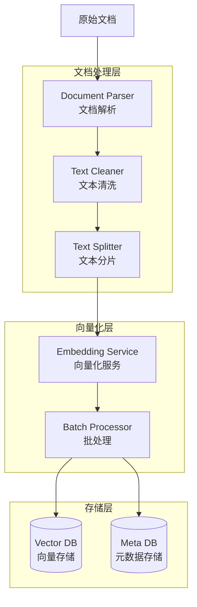
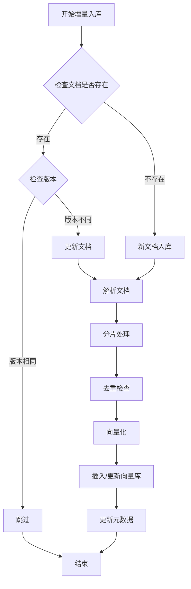
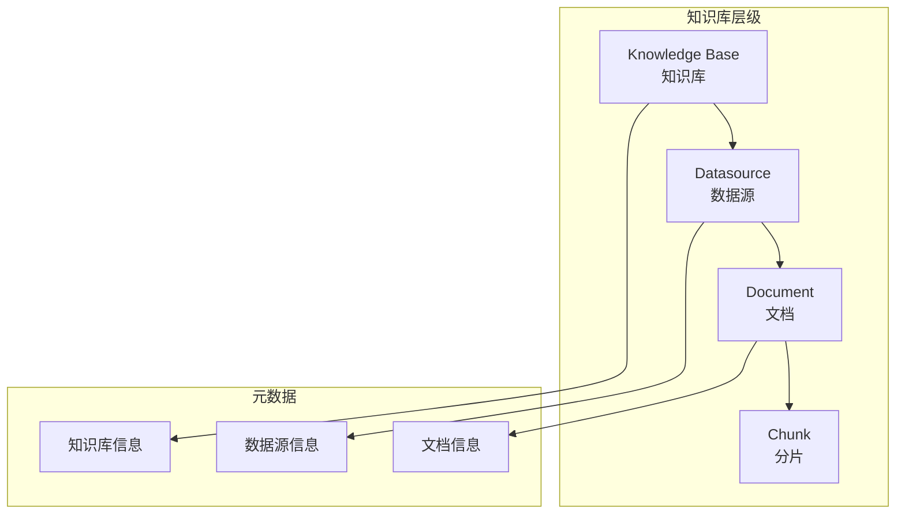

# GaussMaster 文档入库流程详解

## 1. 文档入库概述

文档入库是 RAG 系统的基础，负责将原始文档转换为可检索的向量表示。GaussMaster 支持多种文档格式的解析、分片、向量化和存储。

### 1.1 设计目标

- **格式兼容**：支持多种文档格式（PDF、Word、Markdown、HTML 等）
- **增量更新**：支持在线系统的文档增量入库
- **版本管理**：支持文档版本控制和历史追溯
- **去重处理**：避免重复文档入库

### 1.2 核心组件



## 2. 初始文档入库流程

### 2.1 整体流程

```mermaid
sequenceDiagram
    participant User as 用户
    participant API as API 层
    parser as 文档解析器
    participant Splitter as 文本分片器
    participant Embed as Embedding
    participant VectorDB as Vector DB
    participant MetaDB as Meta DB

    User->>API: 上传文档
    API->>API: 文件格式校验
    API->>API: 生成文档唯一ID
    
    Note over API,parser: 1. 文档解析
    API->>parser: load_knowledge_from_file()
    parser->>parser: 根据扩展名选择解析器
    parser->>parser: 提取文本内容
    parser->>parser: 提取元数据（标题、作者等）
    parser-->>API: 返回原始内容
    
    Note over API,Splitter: 2. 文本处理
    API->>API: 文本清洗
    API->>Splitter: 文本分片
    Splitter->>Splitter: 按规则分片
    Splitter->>Splitter: 去重处理
    Splitter-->>API: 返回分片列表
    
    Note over API,Embed: 3. 向量化
    loop 每个分片
        API->>Embed: doc_embedding(chunk)
        Embed-->>API: 返回向量
    end
    
    Note over API,VectorDB: 4. 数据存储
    API->>VectorDB: batch_insert(chunks, vectors)
    VectorDB-->>API: 插入完成
    
    API->>MetaDB: 更新数据源记录
    MetaDB-->>API: 记录完成
    
    API-->>User: 入库成功
```

### 2.2 文档解析

```python
# common/utils/doc_util.py

def load_knowledge_from_file(file_path, file_type=None):
    """
    从文件加载知识
    
    支持格式：
    - PDF (.pdf)
    - Word (.doc, .docx)
    - Markdown (.md)
    - HTML (.html, .htm)
    - 纯文本 (.txt)
    - CSV (.csv)
    - JSON (.json)
    """
    if not file_type:
        file_type = os.path.splitext(file_path)[1].lower()
    
    # 根据文件类型选择解析器
    parsers = {
        '.pdf': parse_pdf,
        '.doc': parse_word,
        '.docx': parse_word,
        '.md': parse_markdown,
        '.html': parse_html,
        '.htm': parse_html,
        '.txt': parse_text,
        '.csv': parse_csv,
        '.json': parse_json
    }
    
    parser = parsers.get(file_type)
    if not parser:
        raise ValueError(f"Unsupported file type: {file_type}")
    
    return parser(file_path)


def parse_pdf(file_path):
    """解析 PDF 文件"""
    import PyPDF2
    
    text = ""
    with open(file_path, 'rb') as f:
        pdf_reader = PyPDF2.PdfReader(f)
        for page in pdf_reader.pages:
            text += page.extract_text() + "\n"
    
    return {
        'content': text,
        'metadata': {
            'source': file_path,
            'pages': len(pdf_reader.pages),
            'type': 'pdf'
        }
    }


def parse_markdown(file_path):
    """解析 Markdown 文件"""
    with open(file_path, 'r', encoding='utf-8') as f:
        content = f.read()
    
    # 提取标题作为元数据
    title_match = re.search(r'^#\s+(.+)$', content, re.MULTILINE)
    title = title_match.group(1) if title_match else os.path.basename(file_path)
    
    return {
        'content': content,
        'metadata': {
            'source': file_path,
            'title': title,
            'type': 'markdown'
        }
    }
```

### 2.3 文本分片

```python
# common/utils/splitter.py

class TextSplitter:
    """
    文本分片器
    
    分片策略：
    1. 按段落分割
    2. 按句子分割
    3. 按固定长度分割（带重叠）
    4. 按语义分割
    """
    
    def __init__(self, chunk_size=500, chunk_overlap=50, separators=None):
        self.chunk_size = chunk_size
        self.chunk_overlap = chunk_overlap
        self.separators = separators or ["\n\n", "\n", "。", ".", " ", ""]
    
    def split_text(self, text):
        """分割文本"""
        if not text:
            return []
        
        chunks = []
        current_chunk = ""
        
        # 按分隔符分割
        for separator in self.separators:
            if separator in text:
                parts = text.split(separator)
                for part in parts:
                    if len(current_chunk) + len(part) < self.chunk_size:
                        current_chunk += part + separator
                    else:
                        if current_chunk:
                            chunks.append(current_chunk.strip())
                        current_chunk = part + separator
                break
        
        if current_chunk:
            chunks.append(current_chunk.strip())
        
        # 处理重叠
        if self.chunk_overlap > 0 and len(chunks) > 1:
            chunks = self._add_overlap(chunks)
        
        return chunks
    
    def _add_overlap(self, chunks):
        """添加重叠部分"""
        overlapped_chunks = []
        for i, chunk in enumerate(chunks):
            if i > 0:
                # 从前一个 chunk 末尾取重叠部分
                prev_chunk = chunks[i - 1]
                overlap = prev_chunk[-self.chunk_overlap:]
                chunk = overlap + chunk
            overlapped_chunks.append(chunk)
        return overlapped_chunks


class RecursiveTextSplitter(TextSplitter):
    """
    递归文本分片器
    
    优先使用大分隔符，如果分片仍然太大，则使用更小的分隔符递归分割
    """
    
    def split_text(self, text):
        """递归分割文本"""
        return self._recursive_split(text, 0)
    
    def _recursive_split(self, text, separator_index):
        """递归分割"""
        if separator_index >= len(self.separators):
            # 没有更多分隔符，直接截断
            return [text[i:i+self.chunk_size] 
                    for i in range(0, len(text), self.chunk_size - self.chunk_overlap)]
        
        separator = self.separators[separator_index]
        
        if separator not in text:
            # 当前分隔符不存在，尝试下一个
            return self._recursive_split(text, separator_index + 1)
        
        chunks = []
        parts = text.split(separator)
        current_chunk = ""
        
        for part in parts:
            if len(current_chunk) + len(part) < self.chunk_size:
                current_chunk += part + separator
            else:
                if current_chunk:
                    # 如果当前 chunk 仍然太大，递归分割
                    if len(current_chunk) > self.chunk_size:
                        chunks.extend(self._recursive_split(
                            current_chunk, separator_index + 1
                        ))
                    else:
                        chunks.append(current_chunk.strip())
                current_chunk = part + separator
        
        if current_chunk:
            if len(current_chunk) > self.chunk_size:
                chunks.extend(self._recursive_split(
                    current_chunk, separator_index + 1
                ))
            else:
                chunks.append(current_chunk.strip())
        
        return chunks
```

### 2.4 向量化与存储

```python
# common/utils/retriever_util.py

class OnlineEmbedding:
    """在线向量化服务封装"""
    
    async def doc_embedding(self, texts: Union[str, List[str]]):
        """
        文档向量化
        
        支持批量向量化，提高效率
        """
        if isinstance(texts, str):
            texts = [texts]
        
        # 批量向量化
        embeddings = []
        for text in texts:
            embedding = await self._call_embedding_api(text)
            embeddings.append(embedding)
        
        return embeddings if len(embeddings) > 1 else embeddings[0]
    
    async def _call_embedding_api(self, text):
        """调用向量化 API"""
        url = global_vars.configs.get('EMBEDDING', 'embedding_api_url')
        headers = {"Content-Type": "application/json"}
        data = {"text": text}
        
        async with aiohttp.ClientSession() as session:
            async with session.post(url, headers=headers, json=data) as resp:
                result = await resp.json()
                return result['embedding']


# common/metadatabase/dao/gaussdb_vector.py

class GaussDB:
    """向量数据库操作封装"""
    
    def batch_insert(self, documents: List[Dict], vectors: List[List[float]]):
        """
        批量插入文档和向量
        
        参数：
        - documents: 文档列表，每个文档包含 text, title, source 等字段
        - vectors: 对应的向量列表
        """
        if len(documents) != len(vectors):
            raise ValueError("Documents and vectors count mismatch")
        
        # 构建批量插入 SQL
        values_list = []
        for doc, vector in zip(documents, vectors):
            values = {
                'uuid': str(uuid.uuid4()),
                'text': doc['text'],
                'text_vector': str(vector),
                'title': doc.get('title', ''),
                'source': doc.get('source', ''),
                'version': doc.get('version', ''),
                'created_at': int(time.time())
            }
            values_list.append(values)
        
        # 执行批量插入
        self._batch_insert_sql(values_list)
    
    def _batch_insert_sql(self, values_list):
        """执行批量插入 SQL"""
        self._connect()
        
        try:
            for values in values_list:
                sql = f'''
                INSERT INTO "{self.db_index}" 
                (uuid, text, text_vector, title, source, version, created_at)
                VALUES (%s, %s, %s, %s, %s, %s, %s)
                '''
                self.cur.execute(sql, (
                    values['uuid'],
                    values['text'],
                    values['text_vector'],
                    values['title'],
                    values['source'],
                    values['version'],
                    values['created_at']
                ))
            
            self.conn.commit()
        except Exception as e:
            self.conn.rollback()
            raise e
        finally:
            self._close()
```

## 3. 新增文档入库（增量更新）

### 3.1 增量更新策略



### 3.2 去重机制

```python
# common/utils/dedup.py

class DocumentDeduplicator:
    """文档去重器"""
    
    def __init__(self, threshold=0.95):
        self.threshold = threshold
        self.seen_hashes = set()
    
    def is_duplicate(self, text):
        """检查是否重复"""
        # 1. 计算文本哈希
        text_hash = self._compute_hash(text)
        
        if text_hash in self.seen_hashes:
            return True
        
        self.seen_hashes.add(text_hash)
        return False
    
    def _compute_hash(self, text):
        """计算文本哈希"""
        import hashlib
        # 标准化文本（去除空格、转小写）
        normalized = re.sub(r'\s+', '', text.lower())
        return hashlib.md5(normalized.encode()).hexdigest()
    
    def find_similar(self, text, existing_texts):
        """查找相似文本"""
        from difflib import SequenceMatcher
        
        for existing in existing_texts:
            similarity = SequenceMatcher(None, text, existing).ratio()
            if similarity > self.threshold:
                return True, existing
        
        return False, None
```

### 3.3 版本管理

```python
# common/metadatabase/schema/datasource.py

class Datasource:
    """数据源模型"""
    
    __tablename__ = 'datasource'
    
    datasource_id = Column(String(128), primary_key=True)
    kb_id = Column(String(128), nullable=False)  # 知识库ID
    datasource_name = Column(String(256), nullable=False)
    source_type = Column(String(64))  # 来源类型：file/url
    source_path = Column(Text)  # 来源路径
    version = Column(String(64))  # 版本号
    status = Column(String(32))  # 状态：active/inactive
    created_at = Column(Integer)
    updated_at = Column(Integer)
    doc_count = Column(Integer, default=0)  # 文档数量
    vector_count = Column(Integer, default=0)  # 向量数量


class DocumentVersionManager:
    """文档版本管理器"""
    
    def check_version(self, datasource_id, new_version):
        """检查版本是否需要更新"""
        existing = self.session.query(Datasource).filter(
            Datasource.datasource_id == datasource_id
        ).first()
        
        if not existing:
            return True, "new"
        
        if existing.version == new_version:
            return False, "same"
        
        return True, "update"
    
    def update_document(self, datasource_id, new_content, new_version):
        """更新文档"""
        # 1. 删除旧版本向量
        self._delete_old_vectors(datasource_id)
        
        # 2. 插入新版本向量
        self._insert_new_vectors(datasource_id, new_content)
        
        # 3. 更新版本信息
        self._update_version_info(datasource_id, new_version)
    
    def _delete_old_vectors(self, datasource_id):
        """删除旧版本向量"""
        sql = f'DELETE FROM "{self.table_name}" WHERE source = %s'
        self.cur.execute(sql, (datasource_id,))
        self.conn.commit()
```

## 4. 批量入库优化

### 4.1 批处理流程

```python
# common/utils/batch_processor.py

class BatchDocumentProcessor:
    """批量文档处理器"""
    
    def __init__(self, batch_size=100):
        self.batch_size = batch_size
        self.embedding_service = OnlineEmbedding()
        self.vector_db = GaussDB()
    
    async def process_documents(self, documents):
        """
        批量处理文档
        
        流程：
        1. 分批解析
        2. 批量分片
        3. 批量向量化
        4. 批量插入
        """
        all_chunks = []
        
        # 1. 解析和分片
        for doc in documents:
            parsed = self._parse_document(doc)
            chunks = self._split_text(parsed['content'])
            for chunk in chunks:
                all_chunks.append({
                    'text': chunk,
                    'metadata': parsed['metadata']
                })
        
        # 2. 批量向量化
        vectors = await self._batch_embed(all_chunks)
        
        # 3. 批量插入
        self._batch_insert(all_chunks, vectors)
    
    async def _batch_embed(self, chunks):
        """批量向量化"""
        vectors = []
        
        # 分批处理，避免单次请求过大
        for i in range(0, len(chunks), self.batch_size):
            batch = chunks[i:i + self.batch_size]
            batch_texts = [c['text'] for c in batch]
            
            # 批量调用向量化服务
            batch_vectors = await self.embedding_service.doc_embedding(batch_texts)
            vectors.extend(batch_vectors)
        
        return vectors
    
    def _batch_insert(self, chunks, vectors):
        """批量插入数据库"""
        # 分批插入，避免事务过大
        for i in range(0, len(chunks), self.batch_size):
            batch_chunks = chunks[i:i + self.batch_size]
            batch_vectors = vectors[i:i + self.batch_size]
            
            self.vector_db.batch_insert(batch_chunks, batch_vectors)
```

### 4.2 并发处理

```python
import asyncio
from concurrent.futures import ThreadPoolExecutor

class ConcurrentDocumentProcessor:
    """并发文档处理器"""
    
    def __init__(self, max_workers=5):
        self.max_workers = max_workers
        self.executor = ThreadPoolExecutor(max_workers=max_workers)
    
    async def process_concurrent(self, documents):
        """并发处理多个文档"""
        loop = asyncio.get_event_loop()
        
        # 创建任务列表
        tasks = []
        for doc in documents:
            task = loop.run_in_executor(
                self.executor, 
                self._process_single_document, 
                doc
            )
            tasks.append(task)
        
        # 并发执行
        results = await asyncio.gather(*tasks, return_exceptions=True)
        
        # 处理结果
        successful = []
        failed = []
        for doc, result in zip(documents, results):
            if isinstance(result, Exception):
                failed.append({'doc': doc, 'error': str(result)})
            else:
                successful.append(result)
        
        return successful, failed
```

## 5. 知识库管理

### 5.1 知识库结构



### 5.2 知识库 CRUD

```python
# common/metadatabase/dao/dao_knowledge_base.py

class DAOKnowledgeBase:
    """知识库数据访问对象"""
    
    def create_knowledge_base(self, name, description, owner):
        """创建知识库"""
        kb_id = str(uuid.uuid4())
        kb = KnowledgeBase(
            kb_id=kb_id,
            name=name,
            description=description,
            owner=owner,
            status='active',
            created_at=int(time.time()),
            updated_at=int(time.time())
        )
        self.session.add(kb)
        self.session.commit()
        return kb_id
    
    def add_datasource(self, kb_id, name, source_type, source_path):
        """添加数据源"""
        ds_id = str(uuid.uuid4())
        ds = Datasource(
            datasource_id=ds_id,
            kb_id=kb_id,
            datasource_name=name,
            source_type=source_type,
            source_path=source_path,
            status='active',
            created_at=int(time.time()),
            updated_at=int(time.time())
        )
        self.session.add(ds)
        self.session.commit()
        return ds_id
    
    def list_knowledge_bases(self, owner=None):
        """列出知识库"""
        query = self.session.query(KnowledgeBase)
        if owner:
            query = query.filter(KnowledgeBase.owner == owner)
        return query.all()
    
    def delete_knowledge_base(self, kb_id):
        """删除知识库（级联删除）"""
        # 1. 删除向量数据
        self._delete_vectors_by_kb(kb_id)
        
        # 2. 删除数据源记录
        self.session.query(Datasource).filter(
            Datasource.kb_id == kb_id
        ).delete()
        
        # 3. 删除知识库记录
        self.session.query(KnowledgeBase).filter(
            KnowledgeBase.kb_id == kb_id
        ).delete()
        
        self.session.commit()
```

## 6. 索引管理

### 6.1 向量索引创建

```sql
-- 创建向量索引（gsdiskann）
CREATE INDEX IF NOT EXISTS idx_knowledge_vector 
ON knowledge_table 
USING gsdiskann(text_vector l2)
WITH (
    pq_nseg=1024,      -- 向量维度
    pq_nclus=16,       -- 聚类中心数
    queue_size=100,    -- 搜索队列大小
    num_parallels=30,  -- 并行度
    enable_pq=true     -- 启用乘积量化
);

-- 创建 BM25 文本索引
CREATE INDEX IF NOT EXISTS idx_knowledge_text 
ON knowledge_table 
USING bm25(text)
WITH (num_parallels=30);

-- 创建元数据索引
CREATE INDEX IF NOT EXISTS idx_knowledge_source 
ON knowledge_table(source);

CREATE INDEX IF NOT EXISTS idx_knowledge_version 
ON knowledge_table(version);
```

### 6.2 索引重建

```python
class IndexManager:
    """索引管理器"""
    
    def rebuild_vector_index(self, table_name):
        """重建向量索引"""
        # 1. 删除旧索引
        self._drop_index(f"idx_{table_name}_vector")
        
        # 2. 创建新索引
        sql = f'''
        CREATE INDEX idx_{table_name}_vector 
        ON "{table_name}" 
        USING gsdiskann(text_vector l2)
        WITH (pq_nseg=1024, pq_nclus=16, enable_pq=true)
        '''
        self.execute(sql)
    
    def optimize_index(self, table_name):
        """优化索引"""
        sql = f'VACUUM ANALYZE "{table_name}"'
        self.execute(sql)
```

## 7. 监控与统计

### 7.1 入库统计

```python
class IngestionMonitor:
    """入库监控器"""
    
    def __init__(self):
        self.stats = {
            'total_documents': 0,
            'total_chunks': 0,
            'total_vectors': 0,
            'failed_documents': 0,
            'processing_time': 0
        }
    
    def record_success(self, doc_count, chunk_count, processing_time):
        """记录成功"""
        self.stats['total_documents'] += doc_count
        self.stats['total_chunks'] += chunk_count
        self.stats['total_vectors'] += chunk_count
        self.stats['processing_time'] += processing_time
    
    def record_failure(self, doc_count):
        """记录失败"""
        self.stats['failed_documents'] += doc_count
    
    def get_stats(self):
        """获取统计信息"""
        avg_time = (self.stats['processing_time'] / self.stats['total_documents'] 
                   if self.stats['total_documents'] > 0 else 0)
        
        return {
            **self.stats,
            'average_processing_time': avg_time,
            'success_rate': (
                (self.stats['total_documents'] - self.stats['failed_documents']) /
                self.stats['total_documents'] * 100
                if self.stats['total_documents'] > 0 else 0
            )
        }
```

### 7.2 进度追踪

```python
class ProgressTracker:
    """进度追踪器"""
    
    def __init__(self, total_steps):
        self.total_steps = total_steps
        self.current_step = 0
        self.callbacks = []
    
    def add_callback(self, callback):
        """添加进度回调"""
        self.callbacks.append(callback)
    
    def update(self, step=None, message=None):
        """更新进度"""
        if step is not None:
            self.current_step = step
        else:
            self.current_step += 1
        
        progress = {
            'current': self.current_step,
            'total': self.total_steps,
            'percentage': (self.current_step / self.total_steps) * 100,
            'message': message
        }
        
        # 通知所有回调
        for callback in self.callbacks:
            callback(progress)
        
        return progress
```

## 8. 最佳实践

### 8.1 分片策略建议

| 文档类型 | 推荐分片大小 | 推荐重叠大小 | 说明 |
|----------|--------------|--------------|------|
| 技术文档 | 500-1000 字符 | 50-100 字符 | 保持段落完整 |
| FAQ | 完整问题+答案 | 0 | 不分割 |
| 代码 | 函数/类级别 | 0 | 按逻辑单元分割 |
| 论文 | 章节级别 | 100-200 字符 | 保持上下文 |

### 8.2 性能优化建议

1. **批量处理**：批量向量化（100-1000 条/批次）
2. **并发控制**：并发度根据 Embedding 服务能力调整
3. **索引优化**：定期执行 VACUUM ANALYZE
4. **增量更新**：避免全量重建，使用增量更新
5. **去重前置**：在分片前进行文档级去重

### 8.3 常见问题

| 问题 | 原因 | 解决方案 |
|------|------|----------|
| 入库速度慢 | 单条插入 | 使用批量插入 |
| 向量检索慢 | 缺少索引 | 创建 gsdiskann 索引 |
| 内存溢出 | 批量过大 | 减小批处理大小 |
| 重复文档 | 去重机制缺失 | 添加文档哈希去重 |
| 版本混乱 | 版本管理不当 | 使用版本号管理 |

## 9. 总结

GaussMaster 的文档入库流程设计特点：

1. **多格式支持**：支持主流文档格式的解析
2. **智能分片**：递归分片策略，保持语义完整
3. **批量处理**：批量向量化和批量插入，提高效率
4. **增量更新**：支持版本管理和增量更新
5. **去重机制**：多层级去重，避免重复入库
6. **索引优化**：自动创建和优化向量索引
